---
lab:
    title: 'Lab 02.1: Data model and model-driven app'
    module: 'Module 02: Create a model-driven app'
---

> [!NOTE]
> Effective November 2020:
> - Common Data Service has been renamed to Microsoft Dataverse. [Learn more](https://aka.ms/PAuAppBlog)
> - Some terminology in Microsoft Dataverse has been updated. For example, *entity* is now *table* and *field* is now *column*. [Learn more](https://go.microsoft.com/fwlink/?linkid=2147247)
>

# ラボ02.1：データモデルとモデル駆動型アプリ

このラボでは、ソリューションのデータモデルを実装し、問題の修正や全体的な取り組みの管理に使用されるモデル駆動型アプリを構築します。

## あなたが学ぶこと

  - テーブル、列、リレーションシップを作成する

  - モデル駆動型アプリを作成する

  - サイトマップを作成する

  - テーブルフォームを作成して構成する

  - テーブルビューを作成および構成する

## 高レベルのラボ手順

  - 演習1 - 公開元とソリューションを作成する

  - 演習2 – データモデルを実装する
    
      - データモデル
        
          - Building 
          
          - Department 
          
          - Problem Report 

  - 演習3 – フォームとビューを構成する 

  - 演習4 – 基本的なモデル駆動型アプリを作成する 

  - 演習5 – データを入力していくつかのビューを調整し、いくつかの問題レポートをインポートします

## 詳細な手順

### 演習1：公開元とソリューションを作成する

この演習では、カスタムソリューションパブリッシャーとソリューションを作成します。 このソリューションは、このコースのすべてのラボで使用され、すべてのコンポーネントをまとめます。

#### タスク1：公開元とソリューションを作成する

1.  [Power Apps maker portal](https://make.powerapps.com/) に移動し、作成した Practice 環境にいることを確認します。

2.  **Solutions** を選択し、**+ New solution** をクリックします。

3.  **Display name** に **Company 311** を入力しし、クリックします。

4.  **Publisher** ドロップダウンをクリックし、 **+ Publisher** を選択します。

5.  **Display name** に **Lamna Healthcare** を入力し、**Name** に **lamnahealthcare** 、**Prefix** に **lh** 、選択値に **88186** を入力し、 **Save** をクリックします。

6.  **Publisher** ドロップダウンを再度クリックし、作成した **Lamna Healthcare** を選択します。

8.  **Create** をクリックします。

9.  これで、作成したソリューションがソリューションリストに表示されます。

### 演習2：データモデルを実装する

この演習では、Company 311アプリのデータモデルを設計したときに特定したテーブル、列、および関係を作成します。

#### タスク1：テーブルを作成する

1.  [Power Apps maker portal](https://make.powerapps.com/) で、 **Solutions** を選択し、演習1 で作成した **Company 311** ソリューションを開きます。

2.  **+ New** をクリックし、 **Table** を選択します。

3.  **Display name** に **Building** を入力し、 **Create** をクリックします。

4.  ソリューション名をクリックして、ソリューションに戻ります。

5.  **+ New** をクリックし、 **Table** を再度選択します。

6.  **Display name** に **Department** を入力し、 **Create** をクリックします。

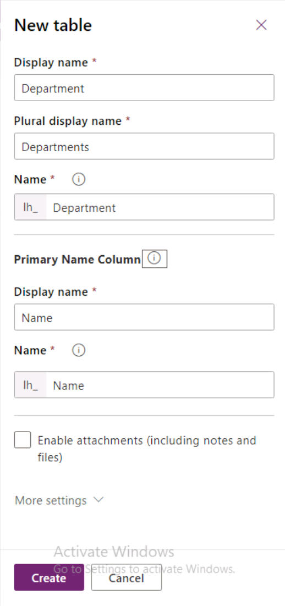

7.  ソリューション名をクリックして、ソリューションに戻ります。

8.  **+ New** をクリックし、再度、 **Table** を選択します。

9.  **Display name** に **Problem Report** を入力し、**Primary Column** の **Display name** を **Title** に変更し、 **More settings** をクリックします。

10. **Collaboration** をクリックし、セクションを展開します。

11. **Enable queues** チェックボックスをオンにして、 **Create** をクリックします。キューを有効にすると、問題レポート行を１つ以上のキューに関連付けて、様々な部門へのルーティングを容易にすることができます。

12. **Confirm changes** ポップアップで、 **Okay** をクリックします。

#### タスク2：列を追加する

このタスクでは、Problem Report テーブルに列を追加します。

1.  [Power Apps maker portal](https://make.powerapps.com/) ページに移動し、正しい環境にいることを確認します。

2.  **Solutions** を選択し、演習1で作成した **Company 311** ソリューションを開きます。

3.  **Problem Report** テーブルを探して、開きます。

4.  **Columns** タブを選択し、 **+ Add Column** をクリックします。

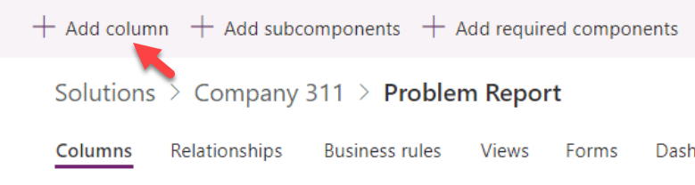

5.  **Display name** に **Location** を入力し、**Data type** から **Text** を選択し、 **Advanced options** をクリックします。

6.  **Max length** に **150** を入力し、 **Done** をクリックします。

7.  再度 **+ Add Column** をクリックします。

8.  **Display name** に **Details** を入力し、**Data type** で **Multiline text** を選択し、 **Required** を選択し、 **Done** をクリックします。

9.  再度 **+ Add Column** をクリックします。

10. **Display name** に **Photo** を入力し、**Data type** をから **Image** を選択し、 **Done** をクリックします。

11. **+ Add Column** をクリックします。

12. **Display name** に **Resolution** を入力し、 **Data type** で **Multiline text** を選択し、 **Done** をクリックします。

13. **+ Add Column** をクリックします。

14. **Display name** に **Resolved On** を入力し、 **Data type** で **Date and time** を選択し、 **Done** をクリックします。

15. **Default** フィルターを選択し、**Custom** クリックをします。(小画面デバイスの場合、デフォルトのドロップダウンは**ellipsis**になります).

16. これで、作成した5つの新しい列が表示されます。 **Save Table** をクリックします。

17. ソリューション名をクリックして、ソリューションに戻ります。

18. [**Publish all customizations**]をクリックして、公開が完了するのを待ちます。

19. すべてのカスタマイズが正常に公開されるまで、このページから移動しないでください。

#### タスク3：ステータス理由の編集選択

このタスクでは、問題レポートテーブルのステータス理由列を編集します。

1.  **Company 311** ソリューションを使用していることを確認してください。

2.  クリックして **Problem Report** テーブルを開きます。

3.  **… More commands** ボタンをクリックし、**Switch to classic** を選択します。

> [!NOTE]  
> 最新のソリューションエクスプローラーはステータス理由の編集をまだサポートしていませんが、将来的にサポートするため、クラシックに切り替えています。

4.  **Fields** を選択し、表示名列で **Status Reason** を探し、ダブルクリックして **Status Reason** 列を開きます。

> [!NOTE]  
> ブラウザでポップアップが有効になっていない場合、列を更新するためのポップアップウィンドウは開きません。 ブラウザタブで開いているポップアップとリダイレクトが有効になっていることを確認してください。 

5.  **Status** で **Active** が選択されていることを確認し、ダブルクリックして**Active** オプションを開きます。

6.  **Label** の値を **New** に変更し、**OK** をクリックします。

7.  **Add** をクリックします。

8.  **Label** に **Assigned** と入力し、**OK** をクリックします。

9.  再度 **Add** をクリックします。

10. **Label** に **In Progress** と入力し、**OK** をクリックします。

11. 再度 **Add** をクリックします。

12. **Label** に **Completed** と入力し、**OK** をクリックします。

13. 再度 **Add** をクリックします。

14. **Label** に **Won't Fix** と入力し、**OK* をクリックします。

15. これで、5つのオプションがあります。 **Default** で **New** を選択し、**Save and Close** をクリックします。

16. **Publish** をクリックして、公開が完了するのを待ちます。

17. **Save and Close** をクリックして、クラシックエディタを閉じます。

18. これで、**Power Apps Maker** ポータルに戻るはずです。

#### タスク4：リレーションシップ

このタスクでは、問題レポートテーブルと建物および部門のテーブルの間に多対1の関係を作成します。

1.  **Problem Report** のテーブルにいることを確認してください。

2.  **Relationships** タブを選択し、**+ Add relationship** をクリックします。

3.  **Many-to-one** を選択します。

4.  **Related (One) Table**　の　**Building** を選択し、**Done** をクリックします。

5.  **+ Add relationship** を再度クリックします。

6.  **Many-to-one** を選択します。

7.  **Related (One) Table**　の　**Department** を選択し、**Done** をクリックします。

8.  **Save Table** をクリックします。

9.  ソリューション名をクリックして、ソリューションに戻ります。

10. **Publish all customizations** をクリックして、公開が完了するのを待ちます。

### 演習3：フォームとビューを構成する

この演習では、Problem Report Table のフォームとビューを構成します。

#### タスク1：フォームを構成する

1.  [Power Apps maker portal](https://make.powerapps.com/) に移動し、正しい環境にいることを確認します。

2.  [ソリューション]を選択し、クリックして **Company 311** ソリューションを開きます。

3.  **Problem Report** テーブルを探し、開きます。

4.  **フォーム** タブを選択し、**Main** タイプの **Information** フォームを開きます。

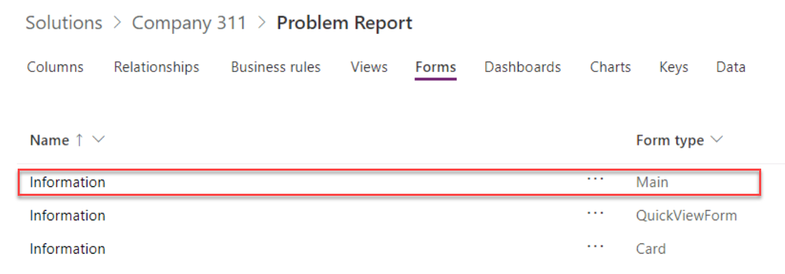

5.  フォームの下部にあるズームコントロールを使用して、簡単に作業できるようにフォームを十分に大きくします。 **form section** を選択します。

6.  **Properties** ペインに移動し、**Label** を **Problem details** に変更し、**Name** に**section\_problem\_report** と入力します。

7.  セクションを選択したまま、**Table Columns** ペインに移動し、**Building** 列をクリックします。 Building 列がフォームに追加されます。

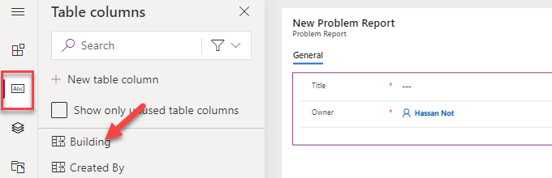

8.  **Details** 列と **Photo** 列をフォームに追加します。

9.  これで、フォームは次の画像のようになります。 **Detail** 列を選択します。

10. **Properties** ペインに移動し、クリックして **Formatting** セクションを展開します。

11. **form field height** を **4** に変更します。

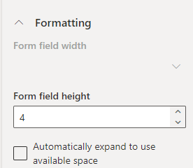

12. ツールバーから **Components** を選択します。

13. **1-Column section** を選択します。

14. 新しいセクションをフォームに追加する必要があります。 **new section** を選択します。

15. **Properties** ペインに移動し、**Section Label** を **Resolution details** に変更し、**Name** に **section\_resolution\_details** と入力します。

16. ツールバーから **Table columns** を選択します。

17. **Department**、**Status Reason**、**Resolved on**、および **Resolution** 列を **Resolution details** セクションに追加します。

18. **Resolution** 列を選択します。

19. **Properties** ペインに移動し、クリックして **Formatting** セクションを展開します。

20. **Form field height** を **4** に変更します。

21. フォームは下の画像のようになります。 **Save** をクリックします。

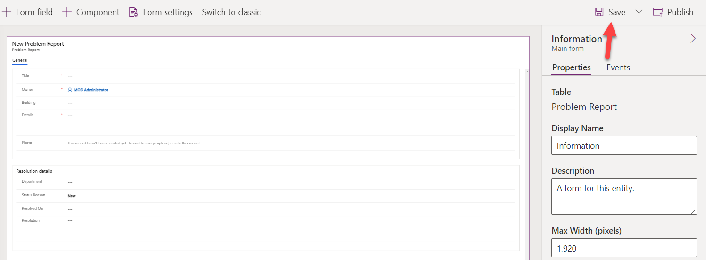

22. **Publish** をクリックして、公開が完了するのを待ちます。

23. **Back** ボタンをクリックします。

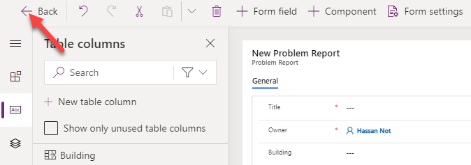

24. これで、テーブルに戻るはずです。

#### Task 2: Edit view

1.  **Vies** タブを選択し、クリックして **Active Problem Reports** ビューを開きます。

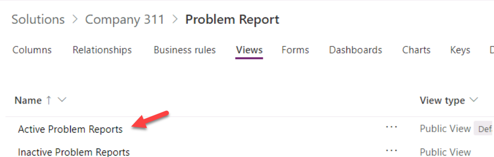

2.  **+View column** をクリックし、**Building** を選択して **Building** 列をビューに追加します。

3.  ビューに **Location**、**Status Reason**、および **Owner** 列を追加します。
    ステータス理由と所有者の列を追加するときは、列フィルターを **All** に変更する必要があります。

4.  ビューのプロパティペインに移動し、**Edit filters** をクリックします。

5.  既存のフィルターを更新し、**Status Reason Equals New** に設定します。

6.  **New** が選択されている列をクリックします。

7.  **Assigned** を選択します。

8.  列をもう一度クリックして、**In Progress** を選択します。

9.  フィルタは次の画像のようになります。 **OK** をクリックします。

10. **Save** をクリックします。

#### タスク3：既存のビューからビューを作成する

このタスクでは、アクティブな問題レポートビューから新しいビューを作成します。

1.  **Edit filters** を選択します。

2.  フィルタから **In Progress** を削除します。

3.  フィルタから **Assigned** 値と **New** 値を削除します。

4.  **Completed** を選択します。

5.  フィルタリングする **Won't Fix** および **Inactive** の値を追加します。

6.  フィルタは次の画像のようになります。 **OK** をクリックします。

7.  保存ボタンの横にある山形ボタンをクリックし、**Save As** を選択します。

8.  **Name** に **Resolved Problems** と入力し、**Save** をクリックします。

9.  ブラウザの **Back Button** をクリックして、ソリューションに戻ります。

10. ソリューション名をクリックして、ソリューションに移動します。

11. **Publish all customizations** をクリックして、公開が完了するのを待ちます。

### 演習4：モデル駆動型アプリケーションを作成する

この演習では、モデル駆動型アプリケーションを作成します。

#### タスク1：新しいモデル駆動型アプリケーションを作成する

1.  [Power Apps maker portal](https://make.powerapps.com/) に移動し、正しい環境にいることを確認します。

2.  [ソリューション]を選択し、クリックして **Company 311** ソリューションを開きます。

3.  **+ New | App | Model-driven app** をクリックします。

4.  **Modern app designer** を選択し、**Create** をクリックします。

5.  名前に **Company 311 Admin** と入力し、**Create** をクリックします。

6. 左側のメニューから **Navigation** を選択します。

   

7. **Area1** を選択します。

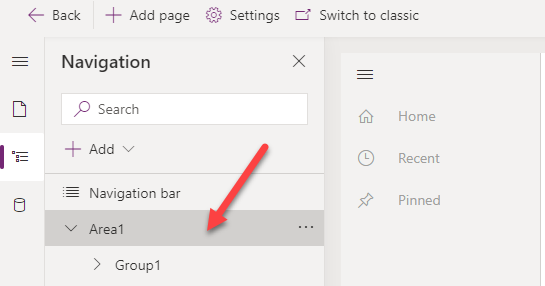

8. **Properties** ペインに移動し、**Title** に**Manage Problems** と入力し、**ID** に **area\_manage\_problems** と入力します。

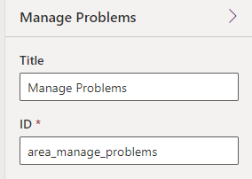

9. **Group1** を選択します。

10. **Properties** に移動し、**Title** に **Problems** を入力し、**ID** に **group\_problems** を入力します。
11. **Subarea1** を選択します。
12. **Properties** ペインに移動し、**Content Type** に**Table** を選択し、**Table** に **Problem report** を選択し、**Problem report** を入力します。
13. 
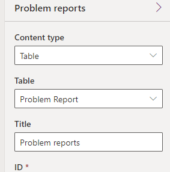

> [!NOTE]
> 新しいアプリデザイナーは、新しいサイトマップエリアを追加する方法をまだ提供していません。

13. **Save** をクリックします。
14. **Switch to classic** をクリックします。

15. **Save and Continue** を選択します。

> [!NOTE] 
> ブラウザでポップアップが有効になっていない場合、クラシックビューは開きません。 ブラウザタブで開いているポップアップとリダイレクトが有効になっていることを確認してください。

16. サイトマップの**Edit** をクリックします。

17.   **+ Add** をクリックして、**Area** を選択します。

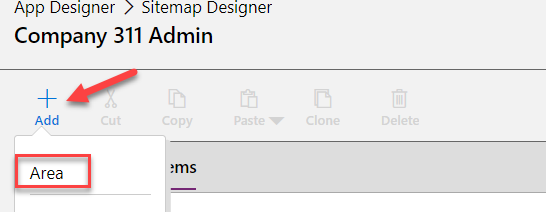

18.   追加した**New Area** を選択します。

19. **Properties** ペインに移動し、**Title** に **Settings** を入力し、**ID**に**area\_settings** を入力します。

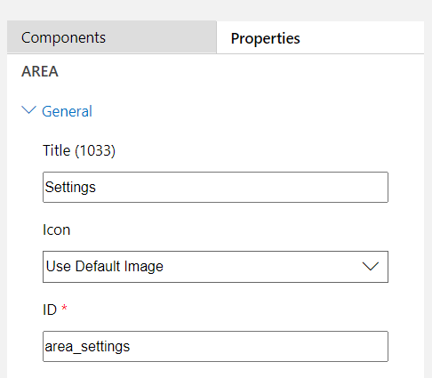

20.  **Save and close** をクリックして、サイトマップエディタを閉じます。

21.  もう一度 **Save and close** をクリックして、クラシックアプリデザイナーを閉じます。

22. これで、新しいアプリデザイナーに戻るはずです。 ブラウザを **Refresh** します。 **Navigation** メニューに切り替えます。

23.  新しい **Settings** 領域が新しいアプリデザイナーに表示されます。 **Setting** エリアを選択します。

24. **+ Add** をクリックし、**Group** を選択します。

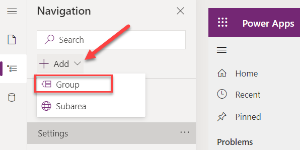

25.  追加した **New Group** を選択します。

26.  **Properties** ペインに移動し、**Title** に **Taxonomy** と入力し、**ID** に **group\_taxonomy** と入力します。

27.  追加した **Taxonomy** グループを選択し、**+ Add** をクリックして、**Subarea** を選択します。

28.   **Content type** に **Table**、**Table** に **Building** を選択し、**Add** をクリックします。

29.  **Taxonomy** グループを選択し、**+ Add** をクリックして、**Subarea** をもう一度選択します。

30.  **Content type** で **Table** を選択し、**Table** で **Department** を選択して、**Add** をクリックします。

31. サイトマップは次の画像のようになります。 **Save** をクリックしてサイトマップを保存します。

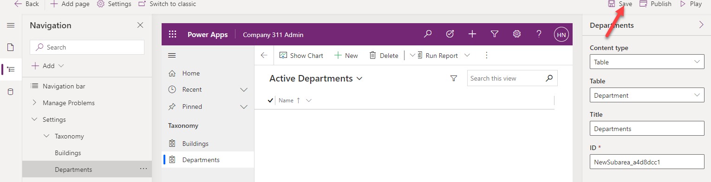

32. **Publishe** をクリックしてサイトマップを公開し、公開が完了するのを待ちます。
33. ブラウザタブを**閉じます** 
34. 新しいタブを開き、 [Power Apps maker portal](https://make.powerapps.com/) に移動し、正しい環境にいることを確認します。
35. ソリューションを選択し、クリックして **Company 311** ソリューションを開きます。
36. **Publish all customizations** をクリックして、公開が完了するのを待ちます。

### 演習5：入力データ

この演習では、Dataverseテーブルにデータを入力します。

#### タスク1：データを入力する

1.  [Power Apps maker portal](https://make.powerapps.com/) に移動し、正しい環境にいることを確認します。

2.  **Apps** を選択し、作成した **Company 311 Admin** アプリケーションを開きます。

3.  **Change area** をクリックします。

4.  **Settings** エリアを選択します。

5.  **Departments** を選択し、 **+ New** をクリックします。

6.  **Name** で **Facility Maintenance** を入力し、 **Save** をクリックします。

7.  再度、 **+ New** をクリックします。

8.  **Name** で **Human Resources** を入力し、 **Save** をクリックします。

9.  **+ New** を再度クリックします。

10. **Name** で、 **Marketing** を入力し、 **Save** をクリックします。

11. **Departments** を選択します。

12. これで、3つの部門行ができました。 **Buildings** を選択します。

13. **+ New** をクリックします。

14. **Name** で **San Francisco Main Campus** を入力し、 **Save & Close** をクリックします。

15. 再度、 **+ New** をクリックします。

16. **Name** で **London Paddington** を入力し、 **Save & Close** をクリックします。

17. これで、2つの構築行ができました。 **Change area**をクリックします。

18. **Manage Problems** を選択します。

19. **+ New** をクリックします。

20. **Title** に **Broken door** を入力し、**Building** に**San Francisco Main Campus** を選択し、**Details* に **The main entrance door will not open all the way** と入力します。

21. **Phone** 列をクリックします。

22. デバイスから画像を選択します。 以下に表示されているサンプル画像は、[ここ]（02-1/media/image89.png）にあります。

23. 画像がフォームに表示されます。

24. **Save & Close** をクリックします。

25. ブラウザタブを閉じます。

### 演習6：データのインポート

この演習では、サンプルデータを環境にインポートします。 行は、ソリューションを使用して最初にインポートするPowerAutomateクラウドフローによってインポートされます。

#### タスク1：ソリューションをインポートする

1.  [Power Apps maker portal](https://make.powerapps.com/) に移動し、正しい環境にいることを確認します。
2.  **Solutions** を選択し、**Import** をクリックします。
3.  **Browse** を選択します。
4.  ラボのリソースフォルダーにある **DataImport.zip** ソリューションファイルを選択し、**Open** をクリックします。
5.  **Next** をクリックします。
6.  再度 **Next** をクリックします。
7.  **Select a connection** ドロップダウンを展開し、**+ New connection** をクリックします。
8.  新しいタブが開き、**Microsoft Dataverse** 接続を作成するように求められます。
9.  **Create** をクリックし、必要に応じて認証し、新しい接続が作成されるまで待ちます。 ブラウザタブを閉じます。
10.  **Refresh** をクリックします。ドロップダウンで新しい接続が選択されていることを確認します。 
11.  **Import** をクリックし、メッセージ **Solution "Data Import" imported successfully** が表示されるのを待ちます。
12.  **Publish all customizations** をクリックして、公開が完了するのを待ちます。 

#### タスク2：フローを確認して実行する

1. [Power Apps maker portal](https://make.powerapps.com/) に移動し、正しい環境にいることを確認します。

2. **Solutions** を選択し、クリックして、インポートした**Data Import** ソリューションを開きます。

3.  クリックして **Import Data** フローを開きます。 **Welcome to Power Automate** ウィンドウの **Get Started** ボタンをクリックします。

> [!NOTE]
> [開始]をクリックしてもフローが開かない場合は、現在のタブを閉じ、前のウィンドウに戻り、[完了]をクリックしてフローを再度開きます。

4.  **Edit** をクリックします。

5.  **Continue** をクリックします。

6.  クリックして、**Input** **Data** ステップを展開します。

7.  値列のJSONテキストを確認します。 これは、環境にインポートされるデータです。 テキストとしてエンコードされた画像データに注意してください。

8.  各コントロールの **Each Department** を展開します。

9.  **Upsert Department** ステップを展開して確認します。

10. 残りの手順を展開して確認します。

11. **Save** をクリックしてフローを保存します。

12. ボタンをクリックして、フローの詳細ページに戻ります。

13. **Run** をクリックします。

14. **Run flow** をクリックします。

15. **Done** をクリックします。

16. フローの実行が完了するのを待ちます。 **Refresh** ボタンをクリックして、フローの実行が正常に完了したかどうかを確認します。

17. フローエディタのブラウザウィンドウまたはタブを閉じます。

18. ポップアップで **Done** をクリックします。

#### タスク3：インポートされたデータを確認する

1.  [Power Apps maker portal](https://make.powerapps.com/) に移動し、正しい環境にいることを確認します。

2.  **Apps** を選択し、クリックして **Company 311 Admin** アプリケーションを開きます。

3.  Problem Reportsを選択します。 少なくとも3つの新しい行が表示されます。

4.  クリックして、**Problem Report** 行の1つを開きます。

5.  **Building** ルックアップの **Search** アイコンをクリックして、Building 行がインポートされたことを確認します。

6.  下にスクロールして、**Department** ルックアップをクリックします。

7.  部門の行がインポートされたことを確認します。

### **Bonus exercise**

  - 部門内の問題レポートの割り当てに対処します。
