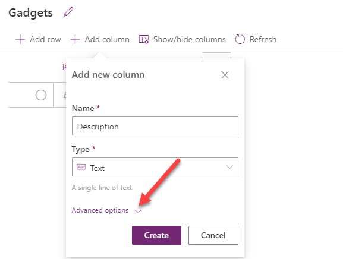
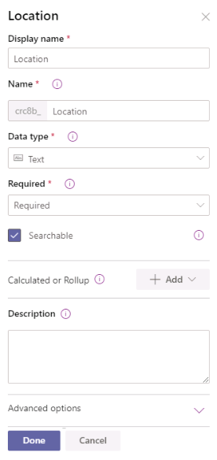
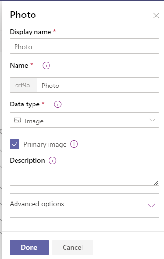
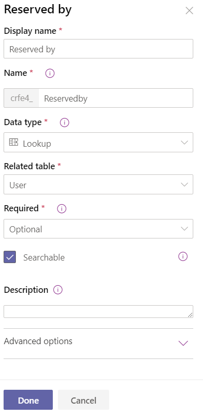
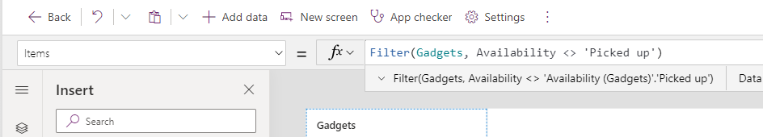

---
lab:
    title: 'Lab 03.1: Create apps in Teams'
    module: 'Module 03: Create a canvas app'
---

> [!NOTE]
> Effective November 2020:
>
> - Common Data Service has been renamed to Microsoft Dataverse. [Learn more](https://aka.ms/PAuAppBlog)
> - Some terminology in Microsoft Dataverse has been updated. For example, *entity* is now *table* and *field* is now *column*. [Learn more](https://go.microsoft.com/fwlink/?linkid=2147247)
>

ラボ03.1：チームでアプリを作成する
=================================

## Scenario

組織が未使用のコンピュータ周辺機器、電源コード、その他の電子機器を蓄積することは珍しくありません。 あなたの組織は、新しい機器を注文する前に、既存のデバイスとコンピュータ周辺機器を再利用するための措置を講じています。

You are asked to create an application where users can post devices they no longer need and browse through what their colleagues posted.

## 要件

1)	アプリケーションは Dataverse for Teamsを使用する必要があります。
2)	ユーザーは、新しいアイテムを作成したり、作成したアイテムを編集したり、他のユーザーが作成したアイテムを表示したりできる必要があります。
3)	アイテムが利用できなくなった場合は、リストから削除する必要があります。
4)  ユーザーがアイテムを予約できるようにします。
5)  ユーザーがアイテムをピックアップ用にマークできるようにします。
6)  アイテムが予約されている場合、予約されたユーザーのみがピックアップされたアイテムにマークを付けることができます。
7)  ユーザーはアイテムを検索できる必要があります。

## あなたが学ぶこと

1)	Dataverse for Teamsを使用してアプリケーションを作成する方法。
2)	アプリケーションを公開する方法。
3)	他のユーザーにアプリケーションへのアクセス許可を与える方法。

## 詳細な手順

### Exercise 1: Get started with Microsoft Dataverse for Teams

この演習では、新しいチームを作成し、Power Apps forTeamsをインストールします。

#### タスク1：チームを作成する
このタスクでは、新しいチームを作成します

1. [Microsoft Teams](https://teams.microsoft.com) に移動します。 
2. **Teams** を選択し、**Join or create a team** をクリックして、**Create Team** をクリックします。


3. **From scratch** を選択します。
4. **Public** を選択します。
5. チーム名に **Green** を入力し、**Create** をクリックします。


6. **Skip** をクリックします。
7. これで、**Green** という名前の新しいチームができました。


8. このページから離れないでください。

#### タスク2：PowerAppsをインストールする
このタスクでは、Power Apps forTeamsをインストールします。

1.  **... More added apps** をクリックし、Power Appsを検索して、**Power Apps** を選択します。


2.  **Add** をクリックします。

3.  ower Apps タブを右クリックして、**Pin** を選択します。


### 演習2：アプリケーションを作成する
この演習では、アプリケーションを作成してチーム用のDataverseをプロビジョニングし、列を含むDataverseテーブルも作成します。

#### タスク1：アプリケーションを作成する
このタスクでは、アプリケーションを作成して、Dataverse forTeamsをプロビジョニングします。
1. [Microsoft Teams](https://teams.microsoft.com) に移動します。

2. Power Appsを選択し、**Start now** をクリックします。


3. 作成した**Green** チームを選択し、**Create** をクリックします。
4. アプリ名に **Upcycle** と入力し、**Save** をクリックします。
5. このページから離れないでください。

#### タスク2：テーブルを作成する
このタスクでは、テーブルと列を作成します。

1. **With data** をクリックし、**+ Create new table** を選択します。


2. テーブル名に **Gadget** と入力し、**Create** をクリックします。
3. **+ Add column** をクリックします。
4. 名前に **Description** を入力し、タイプに **Text** を選択し、クリックして **Advanced options** セクションを展開します。



5. **Max ength** を**500** に変更し、**Create** をクリックします。
6. **+ Add column** をもう一度クリックします。
7. 名前に **Availability** と入力し、タイプに **Choice** を選択し、最初の選択肢に **Available** と入力して、**+ New choice** をクリックします。


8.  2番目の選択肢に **Reserved** と入力し、**+ New choice** をクリックします。
9.  3番目の選択肢として **Picked up** と入力し、**Create** をクリックします。
10. これで、テーブル画面は次の画像のようになります。
     
11.  **Close** ボタンをクリックしてテーブルエディタを閉じます。
12.  このページから離れないでください。


#### タスク3：列を追加する
このタスクでは、テーブルに新しい列を追加します。

1. **Home** タブを選択し、**See more** をクリックします。


2. クリックして **Gadget** テーブルを開きます。
3. **+ Add column** 列をクリックします。
4. 表示名に **Location** を入力し、データタイプに **Text** を選択し、列を **Required** にして、**Done** をクリックします。



5. **+ Add column** をクリックします。
6. 表示名に **Photo** と入力し、データタイプに **Image** を選択し、**Primary image** チェックボックスをオンにして、**Done** をクリックします。



7.  **+ Add column** をクリックします。
8.  表示名に **Reserved by** と入力し、データ型に **Lookup** を選択し、関連テーブルに **User** を選択して、**Done** をクリックします。



9.  **Availability** 列を選択します。
10. デフォルト値として **Available** を選択し、**Done** をクリックします。


11. 画面の右下にある **Save table** ボタンをクリックします。
12. このページから離れないでください。


#### タスク4：アプリケーションを編集する
このタスクでは、使用可能なガジェットのフィルターによってアプリケーションを編集し、フォームを編集します。

1. **Home** タブを選択し、クリックして、作成した **Upcycle** アプリケーションを開きます。
2. **Screen1** を選択します。 画面にすでにフォームが含まれている場合は、次の手順に進みます。それ以外の場合は、**With data** をクリックして、**Current environment** の下の **Gadgets** テーブルを選択します。 これにより、フォームを含む画面要素が作成されます。
3. **RightContainer1** が展開されていることを確認し、ツリービューから **EditForm1** コントロールを選択します。


3. **Properties** ペインに移動し、**Edit fields** をクリックします。


4. **+ Add field** ボタンをクリックします。
5. 以下のリストから EditForm コントロールに存在しないフィールドを選択し、**Add** をクリックします。
   1. **Name**
   2. **Description**
   3. **Availability**
   4. **Location**
   5. **Reserved by**
   6. **Photo**


6. 余分なフィールドをすべて削除し、**Fields** ペインを閉じます。 フォームには、**Name, Description, Availability, Location, Reserved By and Photo** の列のみを含める必要があります。
7. 列にスナップの **Columns** を **1** に変更します。


8. キャンバス内の **Photo** を選択し、**Width** を **400** に変更します。


9.  フォームを展開し、**Reserved by** データカードを選択します。


10. **Properties** ペインに移動し、**Advanced** タブを選択して、**Unlock** をクリックします。


11.   Search for display and change the **DisplayMode** value to **DisplayMode.View**.


12.  Select the **Browse gallery**.
13. Select **Items** form the formula bar and replace the value with formula below. This formula will filter the gadgets to show only the available gadgets

    ```Filter(Gadgets, Availability <> 'Availability (Gadgets)'.'Picked up')```



14.  Select the **Image** inside the gallery.


15.  Go to the formula bar and change the value of the Image to the formula below.

```ThisItem.Photo```


16.   Select the **Data** tab, click on the **...More actions** button of the **Gadgets** table and select **Refresh**.


17.  Click **Save** and wait for the app to be saved.
18.  Click **Preview**.
19.  Click **+ New record**.


20.  Fill out the form and click **Tap or click to add a picture**.


21.  Provide your own photo or select one from the lab resources folder.
22.  Click **Save**.


23.  Add few more items.
24.  Your app should now look like the image below. Close the preview.


25.  Do not navigate away from this page.


#### Task 5: Update Dataverse rows
In this task, you will add buttons that will let users reserve and/or pick up item, you will also update the rows in Dataverse as reserved or picked up.

1. Select **App** from the Tree view and set the **OnStart** value to the formula below. This formula will create a variable named CurrentUser and set its value to the first user that matches the logged in user's email.

```Set(CurrentUser, First(Filter(Users, 'Primary Email' = User().Email)))```


2. Select App, select **ellipsis** and select **Run OnStart**.
3. Select the **RightContainer**.


3. Click on the **+** Insert button and select **Button**.


4. Select the **Tree view**, double click on the button you just added and rename it **Reserve Button**.


5. Set the **Text** value of the Reserve Button to **Reserve**.
6. Move the Reserve Button and place it next to the Image.


7. Set the **DisplayMode** value of the Reserve Button to the formula below. This formula will disable the button if the selected item is not available.

```If(BrowseGallery1.Selected.Availability = 'Availability (Gadgets)'.Available, DisplayMode.Edit, DisplayMode.Disabled)```

8. Set the **OnSelect** value of the Reserve Button to the formula below. This formula will update the selected record by setting the reserved by value to the current user and the availability value to reserved.

```Patch(Gadgets, BrowseGallery1.Selected, {Availability: 'Availability (Gadgets)'.Reserved, 'Reserved by': CurrentUser})```

9. Set the **Visible** value of the Reserve Button to the formula below. This formula will hide the button if the user is creating a new record.

```If(EditForm1.Mode = FormMode.View, true, false)```

10. Select the **RightContainer** again.
11. Click on the **+** Insert button and select **Button** again.
12. Select the **Tree view**, double click on the button you just added and rename it **Picked Up Button**.


12. Set the **Text** value of the Reserve Button to **Picked up**.
13. Adjust the width and move the Picked Up Button and place it to the right of the Reserve Button.


14. Set the **DisplayMode** value of the Picked Up Button to the formula below. This formula will disable the button if the selected item is reserved and the reserved by user is not the current user.

 ```If(BrowseGallery1.Selected.Availability = 'Availability (Gadgets)'.Reserved And BrowseGallery1.Selected.'Reserved by'.'Primary Email' <> CurrentUser.'Primary Email', DisplayMode.Disabled, DisplayMode.Edit)```

15. Set the **OnSelect** value of the Picked Up Button to the formula below. This formula will update the selected record by setting the reserved by value to the current user and the availability value to picked up. The second formula will select the first item of the gallery.

```Patch(Gadgets, BrowseGallery1.Selected, {Availability: 'Availability (Gadgets)'.'Picked up', 'Reserved by': CurrentUser});Select(BrowseGallery1,1)```

16. Set the **Visible** value of the Picked Up Button to the formula below. This formula will hide the button if the user is creating a new record.

```If(EditForm1.Mode = FormMode.View, true, false)```

 17. Click **Save** to save your changes.
 18. Do not navigate away from this page.


#### Task 6: Add search
In this task, you will add search capability to your application.

1. Select the **RightContainer**.
2. Click on the **+** Insert menu and select **+ Add icon**.
3. Place the icon above the form.


4. Select the icon, go to the **Properties** and select **Search** for Icon.


5. Click on the **+** Insert menu and select **Text box**.
6. Select the **Tree view**.
7. Select the text box you just added and rename it **Search box**.


8. Place the Search Box to the right of the icon.


9.  Select the **Search Box** and set **OnChange** value to the formula below. This formula will reset the gallery.

```Reset(BrowseGallery1)```

10. Select the **BrowseGallery** and change the **Items** formula to the formula below. The formula is incomplete, we will complete it in the next step.

```Filter(Search(Gadgets, 'Search Box'.Value, ), Availability <> 'Availability (Gadgets)'.'Picked up')```

11. Place your cursor after **'Search Box'.Value** and type name. You should see a suggestion with crxxx_name, select the suggested column.


12. Add comma after the name column you just selected and type **description** and select the suggested column again.


13. Your formula should now look like the image below. This formula will search the name and description columns of the gadgets table for whatever the user types in the text box and filter out the picked up items.


14.  Select the **Search Box**.
15.  Go to the formula bar and remove the **Value** text.


16.  Click **Save** to save your changes.

### Exercise 3: Test and publish application
In this exercise, you will test, publish and give colleagues permission to use the application.

#### Task 1: Test application
In this task, you will test the application.

1. Click on the **Preview** button.


2. The **Reserve** and **Picked up** button should be visible and enabled.
3. Search for cable. The gallery should show items that have the text **cable** in the name or description column.


4. Select one of the items, the **Reserved by** column value should be empty.
5. Click on the **Reserve** button.


6. The **Reserve** button should become disabled and the **reserved by** value will be set to your username. Click on the **Picked up** button.


7. The item should no longer show up on the gallery and the first item of the gallery should get selected.
8. Close the preview.
9. Do not navigate away from this page.


#### Task 2: Publish application
In this task, you will publish the application to Teams.

1. Click on the **Publish to Teams** button.


2. Click **Next**.
3. Click **+** add app as a tab.


4. Click **Save and close**
5. Select **Teams** and select the new **Upcycle** tab.


6. The app should load. If the app is not loaded, refresh the page.


7. Test the application in Teams and make sure it behaves as you expected.


#### Task 3: Give permissions
In this task, you will give your colleagues permission to create new items, edit items they created, delete items they created and read items created by other people.

1. Select **Power Apps** and click on the **See more** link.


2. Click to open the **Gadget** table.
3. Click **Manage permissions**.


4. Select **Members**, select **Collaborate** permission and click **Save**


5. You may test the application with another user and see how it behaves.

