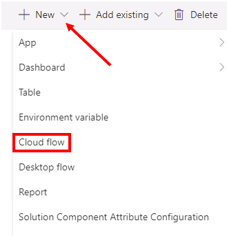

---
lab:
    title: 'Lab 04: Power Automate'
    module: 'Module 04: Power Automate'
---

> [!NOTE]
> Effective November 2020:
> - Common Data Service has been renamed to Microsoft Dataverse. [Learn more](https://aka.ms/PAuAppBlog)
> - Some terminology in Microsoft Dataverse has been updated. For example, *entity* is now *table* and *field* is now *column*. [Learn more](https://go.microsoft.com/fwlink/?linkid=2147247)
>

# ラボ04： Power Automate

このラボでは、Power Automateクラウドフローを作成して、Company 311 ソリューションのさまざまな部分を自動化します。

プロジェクトを完了するために実装する必要のある要件として、以下が特定されています。 

  - 緊急のメンテナンス問題のエスカレーション、承認、および実行プロセス

  - 問題のステータスの変更についてレポートユーザーに通知する 

  - ビジネスルールを使用してロジックを実装する方法。

## あなたが学ぶこと

  - 自動化をサポートするために（データモデル内の）データ列を設計する方法

  - Microsoft Dataverse Connectorを使用してフローを構築する方法

  - 承認の使用方法

## 高レベルのラボ手順

  - エスカレーションをサポートする列を追加する 
  - エスカレーションを承認するためのフローを構築する
  - ステータスの変更をユーザーに通知するフローを作成する
  - Microsoft Teamsでアダプティブカードとして承認を作成する

## Prerequisites

* **ラボ02.1：データモデルとモデル駆動型アプリ** を完了している必要があります
* **ラボ02.2：ビジネスプロセスフローとビジネスルール** を完了している必要があります

## 始める前に考慮すべきこと

  - 緊急のメンテナンスの問題を特定し、それらをエスカレーションするための最も効率的な方法は何ですか

## 詳細な手順  

### 演習1：通知フローを作成する

この演習では、ステータスが変更されたときに問題を作成者に通知するフローを作成します。

#### タスク1：フローを作成する

このタスクでは、問題レポート行のステータスが変更されたときに通知を送信するフローを作成します。

1.  [Power Apps maker portal](https://make.powerapps.com/) に移動し、正しい環境にいることを確認します。 

2.  **Solutions** を選択し、クリックして **Company 311** ソリューションを開きます。

3.  **+ New** をクリックし、**Cloud Flow** を選択します。

4.  **Microsoft Dataverse** コネクタを選択します。 **Microsoft Dataverse** コネクタが表示されていない場合は、**コネクタ** タブを選択してから、**Microsoft Dataverse** を選択します。

5.  **When a row is added, modified or deleted** を選択します。

6.  **Change type** で **Modified** を選択し、**Table name** で **Problem Reports** を選択し、**Scope** で **Organization** を選択して、**Show advanced options** を表示します。

7.  トリガーステップの **Select columns** および **… Menu** ボタンに **statuscode** を入力します。

8.  **Rename** を選択します。

9.  トリガーステップの名前を **When problem report status changes** に変更します。

10.  **+ New step** をクリックします。

11. **Connectors** タブを選択してから、**Microsoft Dataverse** を選択します。 **Get a Row by ID** を選択します。

12. **Table name** に **Users** を選択します。

13. **Row ID** フィールドをクリックし、動的ペインに移動して、**created** を検索し、**Created By (Value)** を1回クリックして追加します。

14. 新しいステップの **Show advanced options** をクリックします。

15. **Select columns** に **internalemailaddress** を入力します。

16. 新しいステップの **… Menu** ボタンをクリックし、**Rename** を選択します。

17. ステップの名前を **Get problem creator** に変更します。

18. **+ New step** をクリックします。

19. **send email** を検索し、**Send an email (V2)** を選択します。

20. **To** 列をクリックして選択し、**Switch to advanced mode** をクリックします。 このボタンをクリックすると、動的ペインの表示と非表示が切り替わります。

21. **Get problem creator** ステップから **Primary Email** 列を選択します。

22. **Subject** に **Problem report status change notification** を入力します。

23. **Body** 列をクリックして選択します。

24. **The status of the problem you reported has changed.** と入力し、**[ENTER]** キーを押します。

25. **Problem Title:** と入力し、[動的]ペインに移動して、**title** を検索し、**Title** を選択します。

26. **[ENTER]** キーを押します。

27. **Current Status:** と入力し、動的ペインに移動して、**Expression** タブを選択し、下に式を貼り付けて、**OK** をクリックします。 この式は、値の代わりに選択したラベルを表示します。

`triggerOutputs()?['body/_statuscode_label']`

28. 新しいステップの **… Menu** ボタンをクリックし、**Rename** を選択します。

29. **Notify problem creator** の名前を変更します。

30. ステップは次の画像のようになります。

31. 上にスクロールして、フロー名を **Notify Problem Creator** に変更します。

32. **Save** をクリックして、フローが保存されるのを待ちます。

33. フローデザイナのブラウザウィンドウまたはタブを **閉じる**。

34. ポップアップウィンドウで **Done** をクリックします。

#### タスク2：フローをテストする

このタスクでは、問題の作成者に通知するフローをテストします。

1.  [Power Apps maker portal](https://make.powerapps.com/) サイトにアクセスし、正しい環境にいることを確認してください。 

2.  **Apps** を選択してから、**Company 311 Admin** モデル駆動型アプリケーションを選択します。 **Play** をクリックします。

3.  **+ New** をクリックします。

4.  **Title** に **Flow test** を入力し、**Building** に **London Paddington** を選択し、**Details** に **This is a flow test** を入力して、**Save** をクリックします。

5.  下にスクロールして、**Status Reason** の値を **In Progress** に変更し、もう一度保存します。

6.  アプリケーションブラウザのウィンドウまたはタブを閉じます。

7.  これで、[Power Apps maker portal](https://make.powerapps.com/) に戻るはずです。 

8.  **Solutions** を選択し、クリックして **Company 311** ソリューションを開きます。

9.  作成した **Notify Problem Creator** フローを見つけてクリックして開きます。

10. **28-day run history section** に成功したフロー実行が表示されます。 クリックして実行を開きます。

11. すべてのフローステップには、**green** のチェックマークが付いている必要があります。

12. **App launcher** をクリックし、**Outlook** を選択します。

13. フローからメールが届くはずです。 クリックしてメールを開きます。

14. メールは下の画像のようになります。

### 演習2：エスカレーションフローを作成する

この演習では、問題レポートテーブルに2つの新しい列を追加し、エスカレーションフローを作成します。

#### タスク1：列を追加する

このタスクでは、問題レポートテーブルに新しい列を追加します。

1.  [Power Apps maker portal](https://make.powerapps.com/) に移動し、正しい環境にいることを確認します。 

2.  **Solutions** を選択し、クリックして **Company 311** ソリューションを開きます。

3.  **Problem Report** テーブルを探し、開きます。

4.  **Columns** タブが選択されていることを確認し、**+ Add Column** をクリックします。

5.  **Display name** に **Estimated Cost** を入力し、**Data type** に **Currency** を選択して、**Done** をクリックします。

6.  画面の右下にある **Save Table** をクリックします。

7.  **Forms** タブを選択します。

8.  クリックして、タイプ **Main** の **Information** フォームを開きます。

9.  フォームに **Estimated Cost** 列を追加し、**Status Reason** 列の下に配置します。

10. **Assign to** 列を追加し、**Estimated Cost** 列の下に配置します。

11. フォームの **Resolution details** セクションは、次の画像のようになります。 **Save** をクリックします。

12. 画面の左上にある **Back** ボタンをクリックします。

13. **Solution** を選択し、**Publish all customizations** をクリックして、公開が完了するのを待ちます。

#### タスク2：エスカレーションフローを構築する

このタスクでは、エスカレーションフローを作成します。

1.  [Power Apps maker portal](https://make.powerapps.com/) に移動し、正しい環境にいることを確認します。 

2.  **Solutions** を選択し、クリックして **Company 311** ソリューションを開きます。

3.  **+ New** をクリックし、**Cloud flow** を選択します。

4.  **when a row is added** を検索し、**Microsoft Dataverse ** コネクタから **When a row is added, modified, or deleted** を選択します。

5.  **Change type** で **Added or Modified** を選択し、**Table name** で **Problem Reports** を選択し、**Scope** で **Organization** を選択し、**Show advanced options** をクリックします。

6.  **Select columns** に **lh_estimatedcost、lh_assignto ** と入力し、**Hide advanced options** をクリックします。

7.  トリガーステップの **… Menu** ボタンをクリックし、**Rename** を選択します。

8.  トリガーステップの名前を **When a problem report is created or updated** に変更します。

9.  **+ New step** をクリックします。

10. **Condition**　を検索し、**Condition**　コントロールを選択します。

11. 最初の **Choose a value** 列をクリックして選択します。

12. 動的コンテンツペインに移動し、**estimated** を検索して **Estimated Cost** を選択します。

13. 2番目のフィールドで **is greater than** を選択し、3番目のフィールドに **1000** と入力します。

14. 条件ステップの名前を **Check if cost is greater than 1000** に変更します。

15. **If yes** ブランチに移動し、**Add an action** をクリックします。

16. **Get a row** を検索し、**Microsoft Dataverse** から **Get a row by ID** を選択します。

17. **Table name** に **Users** を選択します。

18. **Row ID** 列をクリックして選択し、**Dynamic content** ペインから **Assign to (Value)** を選択します。

19. **Show advanced options** をクリックします。

20. **Select columns** に **internalemailaddress** を入力します。

21. **Hide advanced option** をクリックします。

22. **Get a Row by ID** ステップ **Get user** の名前を変更します。

23. **Add and action** をクリックします。

24. **approval** を検索し、**Start and wait for an approval** を選択します。

25. **Approval type** の **Approve/Reject - Everyone must approve** する必要があります。

26. **Title** に **Cost approval required** と入力します。

27. **Assigned to** 列をクリックして選択します。

28. **Dynamic content** ペインに移動し、**Get user** ステップから **Primary Email** を選択します。

29. 以下のマークダウンテキストを **Details** 列に貼り付けます。

> \#\# 緊急の承認が必要です
>
> これは \*\*非常に\*\* 高価なアイテムで、推定コストは

30. コストの後にカーソルを置き、動的コンテンツのペインに移動し、[式]タブを選択して、下に式を貼り付け、**OK** をクリックします。

`formatNumber(triggerOutputs()?['body/lh_estimatedcost'], 'C2')`

31. **Add an action** をクリックします。

32. **Condition** を検索し、**Condition** コントロールを選択します。

33. 最初の**Choose a value** 列をクリックして選択します。

34. **Dynamic content** ペインに移動し、**Outcome** を検索して、**Outcome** を選択します。

35. 2番目のフィールドで **equals to** を選択し、3番目のフィールドの値に **Reject** と入力します。

36. **If yes** ブランチに移動し、**Add an action** をクリックします。
37. **update a Row** を検索し、**Microsoft Dataverse** から **update a Row** を選択します。

38. **Table name** で **Problem Reports** を選択します。

39. **Row ID** 列をクリックして選択します。

40. **Dynamic content** ペインに移動し、**Problem report** を検索して、**Problem Report** を選択します。

41. **Show advanced options** をクリックします。

42. **Resolution** 列をクリックして選択し、**Dynamics content** ペインに移動して、**Response summary** を選択します。

43. **Status Reason** で **Won’t fix** を選択します。

44. ステップの名前を **Update problem report** に変更します。

45. 上にスクロールして、フローの名前を **Escalate Expense Approval** に変更します。

46. **Save** をクリックします。

47. フローデザイナのブラウザウィンドウまたはタブを閉じます。

48. ポップアップで **Done** をクリックします。

#### Task 3: Test flow

In this task, you will test the escalation flow

1.  Navigate to the [Power Apps maker portal](https://make.powerapps.com/) and make sure you are in the correct environment.

2.  Select **Apps** and click to open the **Company 311 Admin** application.

3.  Click to open one of the **Problem Report** rows.

4.  Scroll down, enter **2500** for **Estimated Cost**, assign it to **yourself** (for test purposes) and click **Save**.

5.  Navigate to [Power Automate](https://us.flow.microsoft.com/en-us/)

6.  Expand **Action Items** and select **Approvals**.

7.  You should see at least one approval in the received tab. Click to open the approval. It can take around 10-15 minutes for approvals to show up here on the first run.

8.  Select **Reject**, enter **We don't have the funds for this item** for **comment**, and click **Confirm**.

9.  Go back to the **Company 311 Admin** application.

10. Change the view to **My Reports** and click to open the same row you change the estimated cost.

11. The **Status Reason** should be set to **Won’t fix** and the **Resolution** should contain the details of Approver, Response, Request Date and Response Date.

12. Click **Save**, if you have not done so previously.

### Exercise 3: Send approval requests as adaptive card in Microsoft Teams

In this exercise, you will setup a team in Microsoft Teams dedicated to the Company 311 applications. You will modify the flow to send the approval request as an adaptive card in Teams chat instead of an approval message.

* Task 1: Setup Company 311 Team
* Task 2: Modify flow to send adaptive card in Teams chat
* Task 3: Test adaptive card

#### Task 1: Setup Company 311 Team

In this task you will setup a Microsoft Teams team for the Lamna Healthcare Company, if you have not done so in previous exercises.

1.  Navigate to [Microsoft Teams](https://teams.microsoft.com) and sign in with the same credentials you have been using previously.

2.  Select **Use the web app instead** on the welcome screen.

3.  When the Microsoft Teams window opens, dismiss the welcome messages.

4.  On the bottom left corner, choose **Join or create a team**.

5.  Select **Create a team**.

6.  Press **From scratch**.

7.  Select **Public**.

8.  For the Team name choose **Company 311** and select **Create**.

9.  Select **Skip** adding members to Company 311.

#### Task 2: Modify flow to send adaptive card in Teams chat

In this task you will replace the approval sent by email with the adaptive card.

1. Locate **Start and wait for an approval** step created earlier in **Exercise 2, Task 2**.
2. Select **...** then select **Delete**.
3. Click **+** between the steps to insert a new step then select **Add an action**.
4. Search for **approval** and select **Create an approval**.
5. Select **Approve/Reject - Everyone must approve** for **Approval type**.
6. Enter **Cost approval required** for **Title**.
7. Click to select the **Assigned to** Column.
8. Go to the **Dynamic content** pane and select **Primary Email** from the **Get user** step.
9. Paste the markdown text below in the **Details** Column.

> \*\*{title}\*\*
>
> 
>
> {details}
>
> 
>
> This is a \_very\_ expensive item with the estimated cost of

10. Select **{title}** placeholder, go to the **Dynamic content** pane, locate and select **Title** Column from **When a problem report is created or updated** step.

11. Select **{details}** placeholder, go to the **Dynamic content** pane, locate and select **Details** Column from **When a problem report is created or updated** step.

12. Place your cursor after **cost of** , go to the **Dynamic content** pane, select the **Expression** tab, paste the expression below, and click OK.

`formatNumber(triggerOutputs()?['body/lh_estimatedcost'], 'C2')`

13. Your step should look like the following:

14. Click **+** then select **Add an action**.

15. Search for **teams** and select **Post adaptive card in a chat or channel** action.

16. Select **Flow bot** for Post as and select **Chat with Flow bot** for Post in.
17. Click to select the **Recipient** field.

18. Go to the **Dynamic content** pane and select **Primary Email** from the **Get user** step.

19. Click to select **Adaptive Card** field.

20. Go to the **Dynamic content** pane and select **Teams Adaptive Card** from the **Create an approval** step.
21. Post adaptive card in chat or channel should look like the image below.

22. Select **+** then select **Add an action**.

23. Search for **approval** and select **Wait for an approval** action.

24. Select **Approval ID** Column.

25. Go to the **Dynamic content** pane and select **Approval ID** from the **Create an approval** step.

    

26. You now have replaced **Start and wait for an approval** step with the following:

25. Expand **Condition 2** step. The left side of the condition should be empty because it was referring the step which is now removed. 
26. Go to the **Dynamic content** pane, search for **outcome,** and select **Outcome** from **Wait for an approval** step. 
27. Locate **Update problem report** step under **If yes** branch.
28. Click **Show advanced options**.
29. Click to select the **Resolution** Column, go to the **Dynamic content** pane, and select **Response summary** from **Wait for an approval** step.
30. Click **Save**.
31. Close the flow designer browser window or tab.
32. Click **Done** on the popup.

#### Task 3: Test flow

In this task, you will test the escalation flow with the Teams and adaptive cards.

1.  Navigate to the [Power Apps maker portal](https://make.powerapps.com/) and make sure you are in the correct environment.

2.  Select **Apps** and click to open the **Company 311 Admin** application.

3.  Click to open one of the **Problem Report** Rows.

4.  Scroll down, enter any amount greater than **1000** for **Estimated Cost**, assign it to **yourself** (for test purposes) and click **Save**.

5.  Navigate to [Microsoft Teams](https://teams.microsoft.com)

6.  Select **Chat**.

7. You should see the Cost Approval Required Adaptive Card.

  

8. Press **Reject** button and enter a comment of your choice in the Comments area, for example **The item is too expensive**.

9. Select **Submit**.  The card will become read-only.

10. Go back to the **Company 311 Admin** application.

11. Change the view to **My Reports** and click to open the same Row you change the estimated cost.

12. The **Status Reason** should be set to **Won’t fix** and the **Resolution** should contain the details of Approver, Response, Request Date and Response Date.

## **Discussion**

  - Would creating a bool Column for Approved/Rejected be better?
  - What are the pros and cons of using Microsoft Teams over regular email?

## **Bonus exercises**

  - Add ability for the users to subscribe to the reported problems and only notify if there is a subscription. 
  - Auto-subscribe creator of the problem report.
  - How to find out previous value of status reason?
  - Create your own adaptive card using [Adaptive Cards Designer](https://adaptivecards.io/designer/).
