---
lab:
    title: 'Lab 05: Power BI'
    module: 'Module 05: Power BI'
---

> [!NOTE]
> Effective November 2020:
> - Common Data Service has been renamed to Microsoft Dataverse. [Learn more](https://aka.ms/PAuAppBlog)
> - Some terminology in Microsoft Dataverse has been updated. For example, *entity* is now *table* and *field* is now *column*. [Learn more](https://go.microsoft.com/fwlink/?linkid=2147247)
>


# ラボ05：Power BI

このラボでは、会社の従業員から報告された問題に関するデータを視覚化するPowerBIダッシュボードを作成します。

## あなたが学ぶこと

  - Dataverseに接続する方法
  - データモデルを改良し、レポート用に準備する方法
  - PowerBIビジュアライゼーションを作成する方法
  - PowerBIレポートをMicrosoft Teamsに埋め込む方法

## 高レベルのラボ手順

以下の手順に従って、PowerBIダッシュボードを設計および作成します。

-   Microsoft Dataverseのテーブルに接続します
-   データを変換して、関連する行（ルックアップ）のわかりやすい説明を含めます
-    問題レポートに関する情報をさまざまに視覚化したレポートを作成して公開します
-    追加の視覚化を構築するためのユーザー自然言語クエリ
-    モバイルビューを構築する
-    Company 311 PowerBIレポートをMicrosoft Teamsに埋め込みます

## 前提条件

* **ラボ02.1：データモデルとモデル駆動型アプリ** を完了している必要があります
* コンピューターにプログラムをインストールするためのアクセス許可（Power BI Desktopのインストールに必要）

## 始める前に考慮すべきこと

-   レポートの対象読者は誰ですか？
-   聴衆はどのようにレポートを消費しますか？ 典型的なデバイス？ 位置？
-   視覚化するのに十分なデータがありますか？
-   訪問に関するデータを分析するために使用できる可能性のある特性は何ですか？

## 詳細な手順

### 演習1：環境とデータを準備する  

**目的：** この演習では、Power BI Desktopをインストールして構成し、Microsoft Dataverseへの接続を構成します。

> [!IMPORTANT]
> デスクトップアプリケーションをインストールするために必要なアクセス許可がない場合、またはPower BI Desktopの構成とデータへの接続で問題が発生した場合は、**補遺：サンプルデータのインポート**を実行してから**演習2 **に進みますが、PowerBIを使用します Power BIDesktopの代わりにサービス。

#### タスク1：PowerBIデスクトップを構成する

1. Power BI Desktopがインストールされていない場合は、[https://aka.ms/pbidesktopstore](https://aka.ms/pbidesktopstore) に移動して、Power BI アプリをダウンロードしてインストールします。

> [!IMPORTANT]
> Microsoft Storeを使用したPowerBI Desktopのインストールで問題が発生した場合は、[https://aka.ms/pbiSingleInstaller](https://aka.ms/pbiSingleInstaller) からダウンロードできるスタンドアロンインストールを試してください。

2. Power BIデスクトップを開きます。
3. 以前にPowerBI Desktopにサインインしたことがある場合は、**File | Sign out** を選択します。  
4. プロンプトが表示されたらサインインするか、**File | Sign in** してサインインします。 
5. 初めてサインインする場合は、次のプロンプトが表示される場合があります。


6. **Sign up for Power BI** を選択し、プロンプトに従ってサインアップを完了します。 

#### タスク2：データを準備する

1.  組織URLを確認する

    * [Power Platform Admin Center](https://aka.ms/ppac) に移動します。 
    * 左側のナビゲーションページで、環境を選択し、ターゲット環境をクリックします。
    * **Details** パネルで **Environment URL** を右クリックし、**Copy link** を選択します。


2. PowerBIデスクトップに切り替えます。
3. **Get data | More...** を選択します。


4. **Power Platform** を選択し、次に **Dataverse** を選択して、**Connect** を押します。

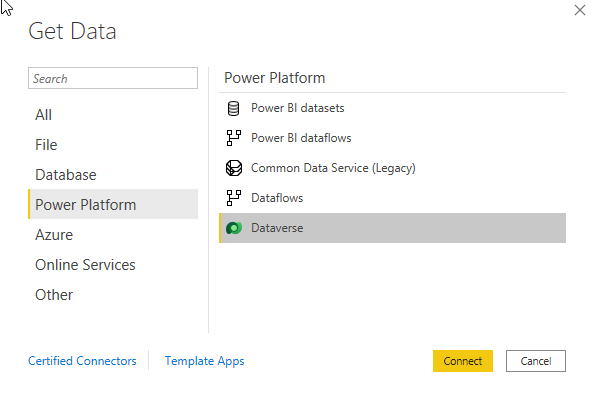

5. 以前にコピーした環境URLをhttps：//なしで貼り付け、**DirectQuery** を選択して、**OK** をクリックします。

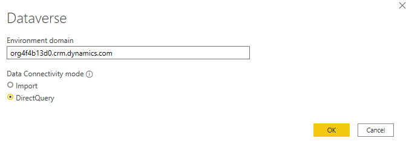

6. 接続の詳細ダイアログが開きます。 サインインしていない場合は、**Sign in** をクリックし、プロンプトに従ってサインインします。**Connect** を押します。

7. 環境ノードを展開し、**lh_Building**、**lh_Department**、**lh_ProblemReport** テーブルを選択して、**Load** を選択します。

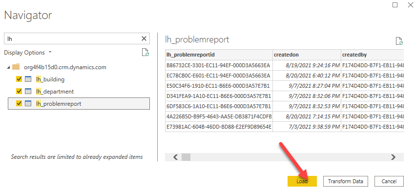

8. 左側の垂直ツールバーの **Model* アイコンをクリックします。

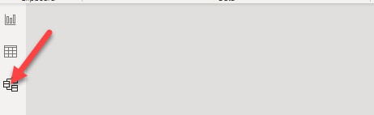

9. Power BIは、テーブル間の関係を検出する必要があります。 関係は下の画像のようになります。

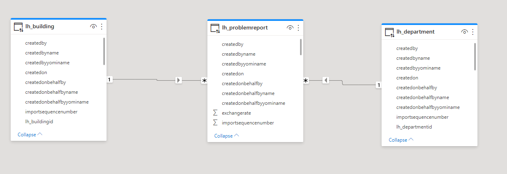

10.  左側のツールバーの **Report** アイコンを選択します。


11. **Fields** パネルで **lh_ProblemReports** ノードを展開します。

12. **lh_ProblemReports** テーブルの **...** その他のオプションボタンをクリックします。

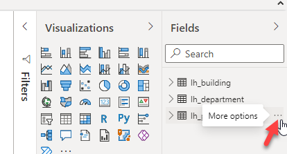

13. **New column** を選択します。

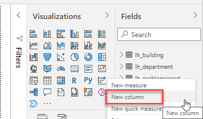

14. 以下の式を完成させ、ENTERを押すか、チェックマークボタンをクリックします。 これにより、建物名の新しい列が問題レポートデータに追加されます。

```Building = RELATED(lh_Building[lh_name])```

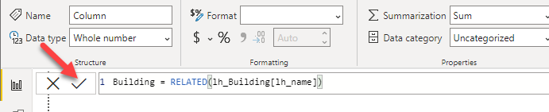

15. **lh_problemreports** ノードで前の3つの手順を繰り返して、次の式で列 **Department** を追加します。

```Department = RELATED(lh_Department[lh_name])```

16.  **lh_problemreport** テーブルの **lh_problemreportid** 列で ... をクリックし、**Rename** を選択します。 列名として **Problem Report** を入力します。
17.  **statuscodename** 列で ... をクリックし、**Rename** を選択します。 列名として **Status** を入力します。
18.  **File &#124; Save** を押して、進行中の作業を保存します。 **Save** し、ファイル名として **Problem management** を入力します。

### 演習2：PowerBIレポートを作成する

**目的：** この演習では、MicrosoftDataverseテーブルのデータに基づいてPowerBIレポートを作成します。

#### タスク1：チャートと時間の視覚化を作成する

1. **Visualizations** パネルの **Pie chart** アイコンをクリックして、グラフを挿入します。


2. **Building** 列をドラッグし、**Legend** ターゲットボックスにドロップします。
3. **Problem Report** 列をドラッグして、**Values** ターゲットボックスにドロップします。


4. すべてのグラフコンポーネントが表示されるように、コーナーハンドルを使用して円グラフのサイズを変更します。 レポートは次のようになります。

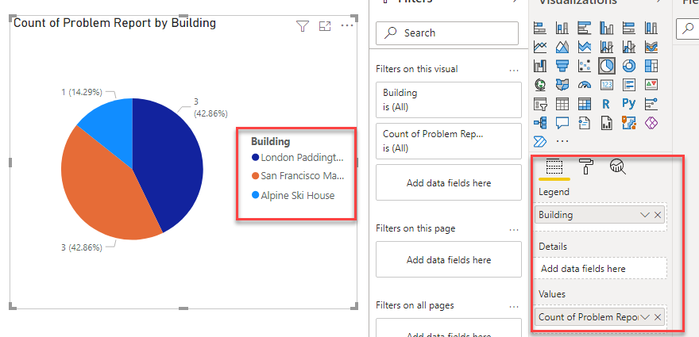

5. Power BIリボンの **New visual** をクリックし、**Visualizations** ペインで **stacked column** グラフを選択します。 


6. **Problem Report** 列をドラッグして、**Values** ターゲットボックスにドロップします。
7. **Status** 列をドラッグして **Axis** ターゲットボックスにドロップします。
8. コーナーハンドルを使用して、必要に応じてグラフのサイズを変更します。
9. レポートの双方向性をテストします:

    * 円グラフでさまざまな建物のスライスを選択し、積み上げ縦棒グラフで変化を観察します。
    * 積み上げ縦棒グラフでさまざまな棒を選択し、円グラフの変化を観察します。

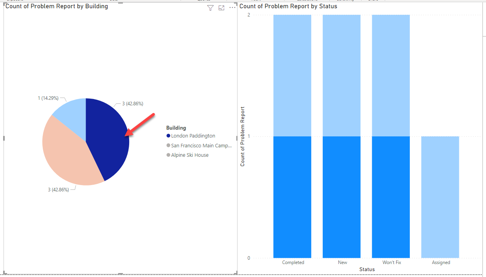

10. **Insert** を選択し、**Q＆A** をクリックします。

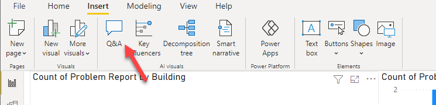

11.  **Turn on Q&A** を選択し、Q＆Aの準備が整うのを待ちます。
12.  **bar count of problem reports by building** と入力し、Enterキーを押します。 棒グラフが表示されます。

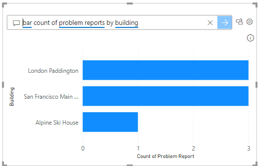

13.  ダッシュボードでQ＆Aが有効になりました。 Q＆Aビジュアルの **...** その他のオプションボタンをクリックし、**Remove** をクリックします。

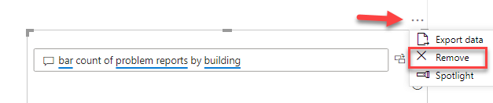

14.  **File | Save** を選択して、進行中の作業を保存します。


### 演習3：PowerBIダッシュボードを作成する

#### タスク1：PowerBIレポートを公開する

1. [Power BI Service](https://app.powerbi.com) に移動します。
2. **Workspaces** を選択し、**Create a workspace** をクリックします。

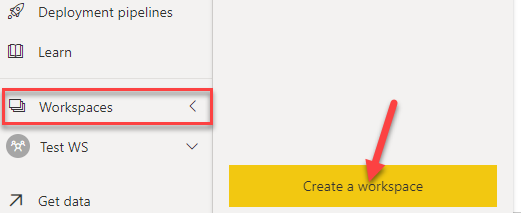

3. ワークスペース名に **311 Workspace** と入力し、**Save** をクリックします。
4. Power BIデスクトップアプリケーションに戻り、**Home** タブを選択して、**Publish** をクリックします。


5. 宛先として**311 Workspace** を選択し、**Select** をクリックします。

6. 公開が完了するまで待ち、**Open \<name of your report\>.pbix in Power BI** をクリックします。


これにより、公開されたレポートがブラウザで開きます。

> [!NOTE]
> PowerBIサービスで「データソースに資格情報がないためアクセスできません」というエラーが表示される場合は、次の手順に従ってください:
>
> 1. 311ワークスペースを選択し、問題管理データセットを選択します。
> 2. 更新ドロップダウンを展開し、更新のスケジュールを選択します。
> 3. データソースの資格情報セクションを展開し、資格情報の編集を選択します。
> 4. 認証方法にはOAuth2を選択し、プライバシーレベル設定には組織を選択します。
> 5. サインインを選択します。 これにより、レポートの問題が解決され、PowerBIサービスに正しく表示されるはずです。

#### タスク2：PowerBIダッシュボードを作成する

1. **311 Workspace** を展開します。
2. **Reports** の見出しの下にある **Problem management** レポートを選択します。

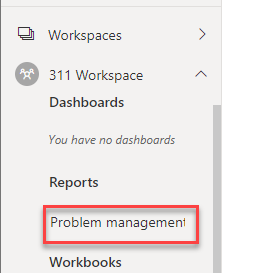

3. メニューで **Pin to a dashboard** を選択します。 レイアウトによっては、追加のメニュー項目を表示するために**...** を押す必要がある場合があります。

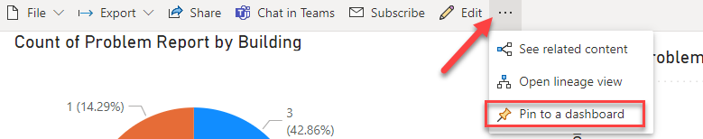

4. **Pin to dashboard** プロンプトで **New dashboard** を選択します。
5. **Dashboard name** として**Problem Management Dashboard** を入力し、**Pin live** を選択します。


6. **311 Workspace** ノードを選択し、**Problem Management Dashboard** を選択します。
7. 表示される円グラフと棒グラフの対話性をテストします。

#### タスク3：自然言語を使用して視覚化を追加する

1. ダッシュボードの上部にある **Ask a question about your data** を選択します。


2. Q＆Aエリアに **funnel count of problem reports by status** を入力します。 ファンネルチャートが表示されます。
3. **Pin visual** を選択します。

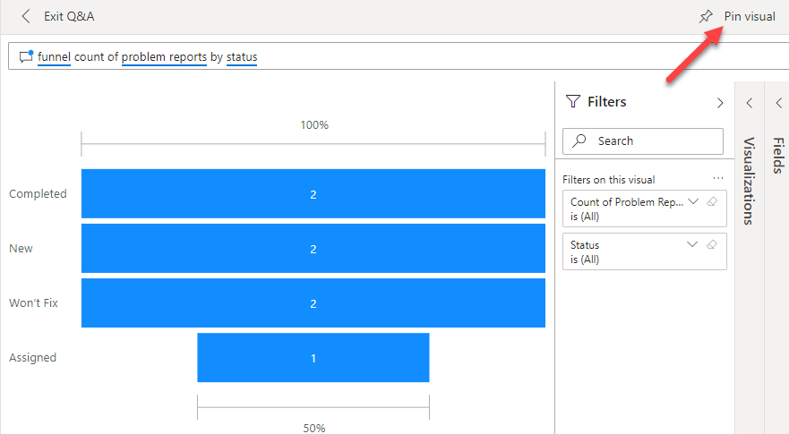

4. **Existing dashboard** を選択し、**Problem Management dashboard** を選択し、**Pin** を選択します。

#### タスク4：携帯電話ビューを作成する

1. **Dashboards** 領域から **Problem Management dashboard** を選択します。
2. **Edit** をクリックし、ドロップダウンボックスから **Mobile view** を選択します。
3. 必要に応じてタイルを再配置します。

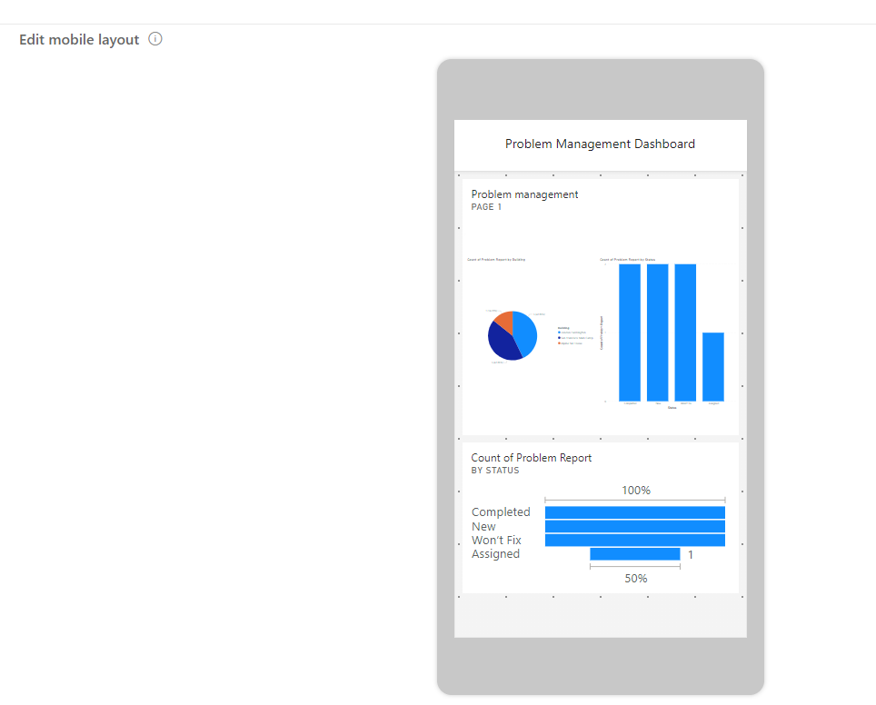

4. **311 Workspace | Reports** でレポートを選択します。
5. **File** を選択し、ドロップダウンボックスから **Generate QR Code** を選択します。

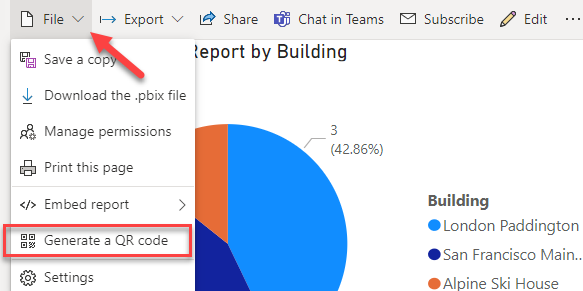

6. モバイルデバイスをお持ちの場合は、iOSプラットフォームとAndroidプラットフォームの両方で利用可能なQRスキャナーアプリを使用してコードをスキャンします。

> [!NOTE]
> ダッシュボードとレポートにアクセスするには、同じユーザーとして電話にサインインする必要があります。

7. モバイルデバイスでレポートとダッシュボードをナビゲートして探索します。 

### 演習4：Power BIレポートを埋め込む

この演習では、管理者とスタッフがTeamsとモデル駆動型アプリケーション内から直接レポートを表示できるようにする方法として、Company 311 PowerBIレポートをMicrosoftTeamsとCompany311Adminモデル駆動型アプリケーションに追加します。 

#### タスク1：Company 311 チームをセットアップする

このタスクでは、Lamna HealthcareCompanyのMicrosoftTeamsチームをセットアップします（これまでにセットアップしたことがない場合）。

1.  [Microsoft Teams](https://teams.microsoft.com) に移動し、以前に使用した資格情報を使用してサインインします。 

2.  ようこそ画面で **Use the web app instead** を選択します。

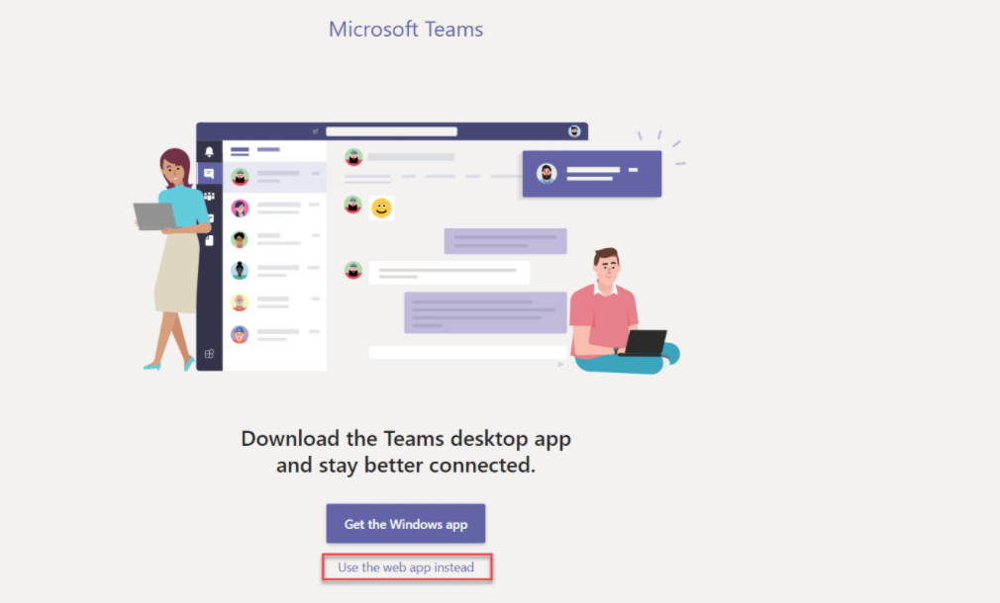

3.  Microsoft Teamsウィンドウが開いたら、ウェルカムメッセージを閉じます。

4.  左下隅で、**Join or create a team** を選択します。

5.  **Create a team** を選択します。


6.  **From scratch** を押します。

7.  **Public** を選択します。

8.  チーム名として **Company 311** を選択し、**Create** を選択します。

9.  Company 311 にメンバーを追加する **Skip** を選択します。


#### タスク2：PowerBIレポートをチームに埋め込む

1.  [Microsoft Teams](https://teams.microsoft.com) に移動します。 

2.  **Company 311** チームの **General** チャネルを選択します。

3.  ページの上部にある **+** 記号を押して、新しいタブを追加します。


4.  **power** を検索し、結果から **Power BI** を選択します。

5.  **311 Workspace** を展開し、このラボで以前に作成したレポートを選択して、**Save** をクリックします。

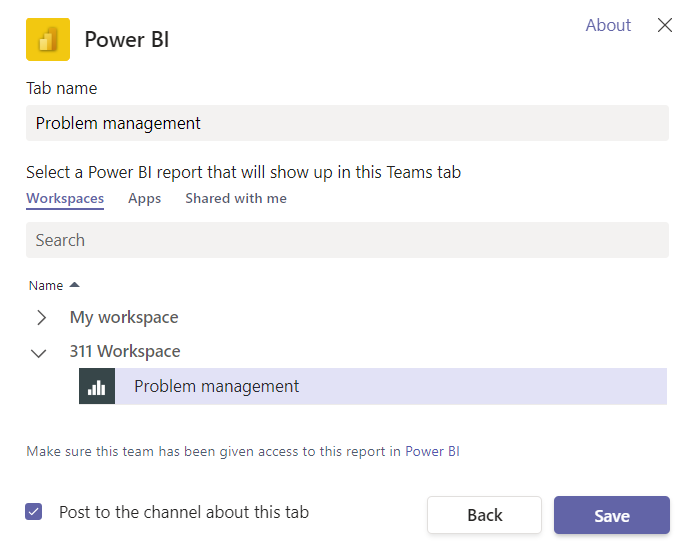

6.  これで、MicrosoftTeamsのタブにPowerBIレポートが表示されます。

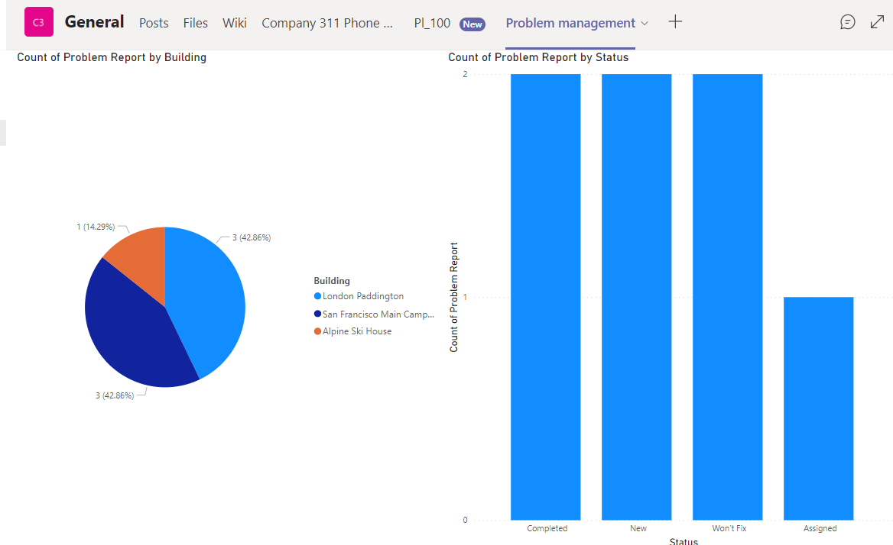


#### タスク3：PowerBIレポートをモデル駆動型アプリに埋め込む

1. [Power BI](https://app.powerbi.com/home) に移動します。 
2. クリックして **Datasets** を選択します。

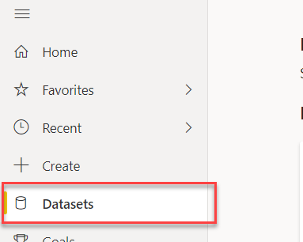

3. 作成したデータセットにカーソルを合わせ、**...** その他のオプション ボタンをクリックして、**Settings** を選択します。

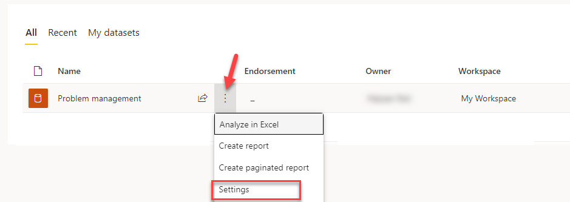

4. データソースの資格情報セクションにある **Edit credentials** をクリックします。
5. 認証方法として **OAuth2** を選択し、プライバシーレベル設定として **Organizational** を選択して、**Sign in** をクリックします。

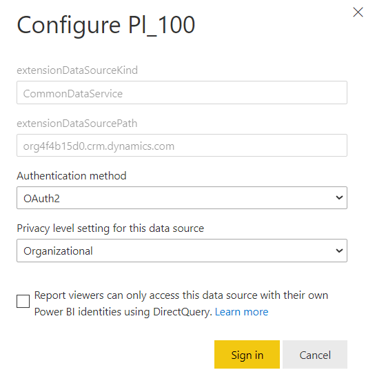

6. クレデンシャルを入力します。
7. [Power Apps maker portal](https://make.powerapps.com/) に移動し、練習環境にいることを確認します。 
8. **Solutions** を選択し、クリックして **Company 311** ソリューションを開きます。
9. **+ New** をクリックして、**Dashboard | Power BI embedded** を選択します。

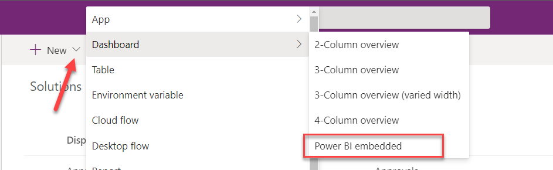

10.  表示名に **Problem management** を入力し、タイプに **Power BI report** を選択し、PowerBIワークスペースに **311 Workspace** を選択し、PowerBIレポートに **Problem management** を選択して **Save** をクリックします。

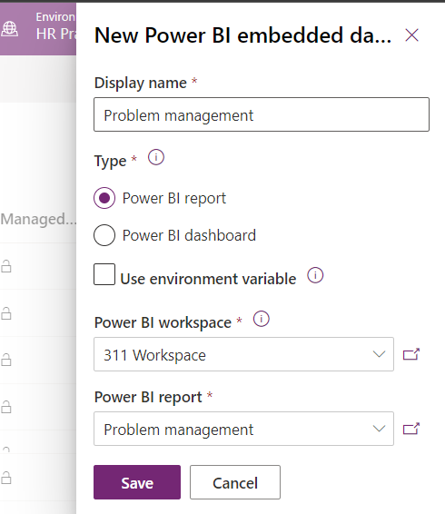

11.  **Publish all customizations** をクリックして、公開が完了するのを待ちます。
12.  Company 311ソリューションを使用しているときに、クリックして **Company 311 Admin** モデル駆動型アプリケーションを開きます。

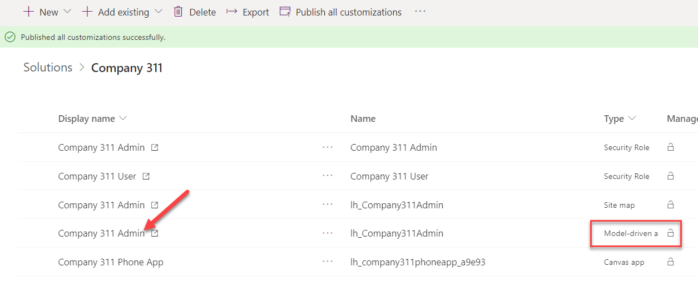

13.  サイトマップの **Edit** アイコンをクリックします。

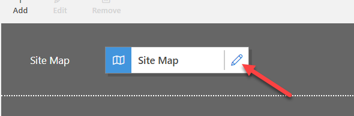

14.  **+ Add** をクリックし、**Group** を選択します。

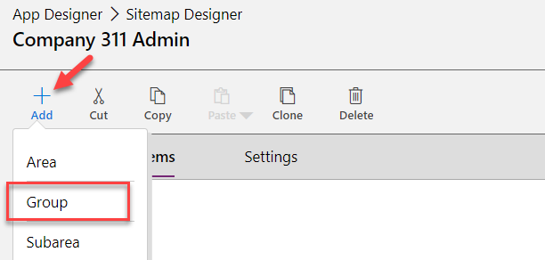

16.  **Properties** ペインに移動し、タイトルに **Report** と入力します。
17.  作成した **Reports** グループを選択し、**+ Add** をクリックして、**Subaea** を選択します。

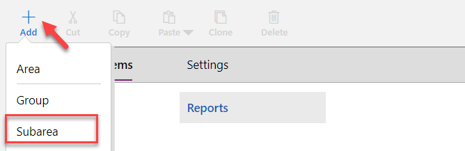

18.   **Properties** ペインに移動し、タイプに **Dashboard** を選択し、デフォルトダッシュボードに **Problem management** を選択し、タイトルに **Problem report** と入力します。

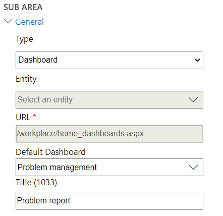

19.  新しい **Reports** グループをドラッグし、**Problems** グループの前にドロップします。
20.  **Manage Problems** 領域のグループは次の画像のようになります。

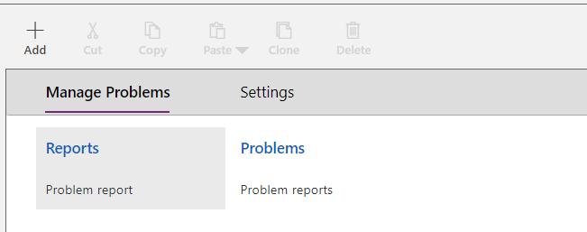

21.  **Save and Close** をクリックして、サイトマップエディタを閉じます。
22.  もう一度 **Save and Close** をクリックして、アプリデザイナーを閉じます。
23.  **Done** をクリックします。
24.  **Publish all customizations** をクリックして、公開が完了するのを待ちます。
25.  **Apps** を選択し、クリックして **Company 311 Admin** モデル駆動型アプリケーションを起動します。
26.  レポートが読み込まれるはずです。

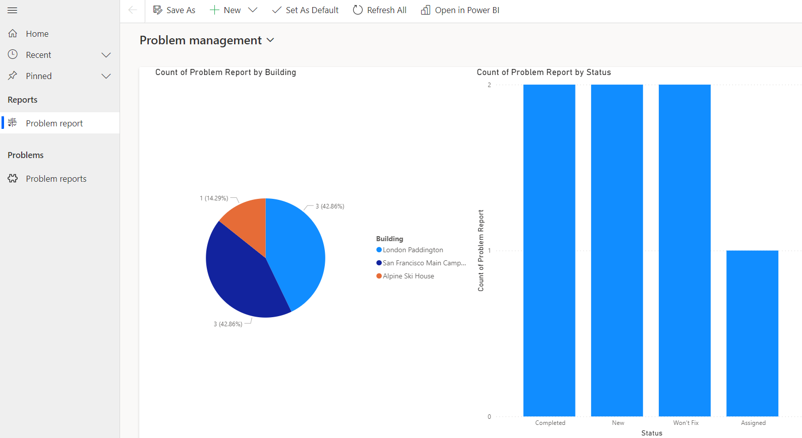

27.  レポートを操作して、期待どおりに動作することを確認します。

### 演習5：Power BI 埋め込みキャンバス

この演習では、埋め込みキャンバスアプリケーションをビジュアルとしてPower BIに追加します。


#### タスク1：キャンバスを追加する

1. [Power BI](https://app.powerbi.com) に移動します。 
2. **Workspaces** を選択してから、**311 Workspace** を開くことを選択します。
3. クリックして、**Problem management** レポートを開きます。
4. **Edit** をクリックします。
5. 以下に示すように、ビジュアルのサイズと位置を変更します。


6. キャンバスの何もない領域をクリックし、**Visualizations**　に移動して、**Power Apps for Power BI**　をクリックします。

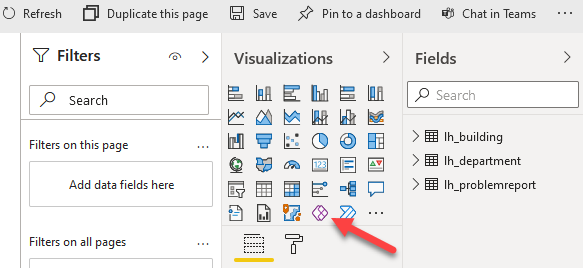

7. 作成したPowerBIビジュアルを選択し、**lh_problemreport** テーブルを展開して **Problem Report** 列を選択します。

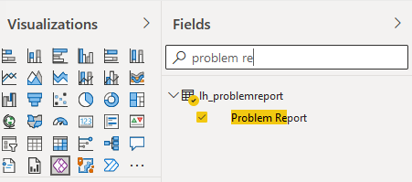

8. 練習環境を選択し、**Create new** をクリックします。

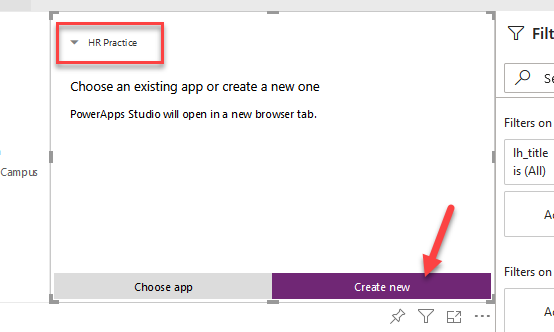

9. 新しいブラウザウィンドウまたはタブが開き、アプリスタジオが読み込まれます。
10. このページから離れないでください。

#### タスク2：アプリをカスタマイズする

1.  **Gallery** を右クリックして、**Delete** を選択します。

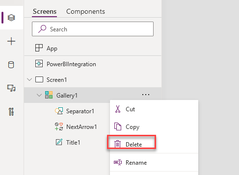

2.  **File** をクリックします。
4.  **Settings** を選択します。
5.  **Display** を選択します。
6.  **Landscape** の **Orientation** を変更します。
7.  ポップアップで **Apply** をクリックします。
8.  **Settings** ウィンドウを閉じます。
9.  **Data** を選択し、**Add data** をクリックします。

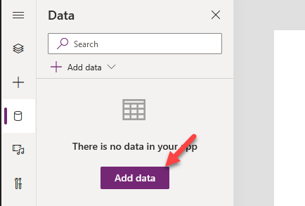

10.  **Problem reports** テーブルを選択します。

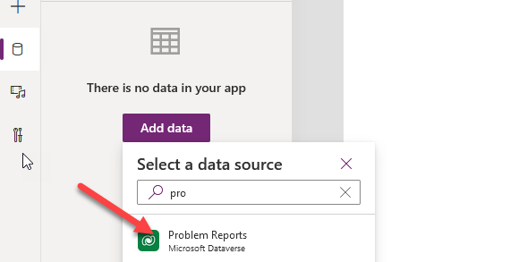

11.  ツリービューから **App** オブジェクトを選択します。
12.  **App** オブジェクトの **OnStart** を選択し、以下の式に設定します。 この数式は、レポートテーブルの現在のインデックスを追跡するための変数と、現在のアイテム行を追跡するための変数の2つを作成します。

```Set(currentIndex,1);Set(CurrentItem, LookUp('Problem Reports', 'Problem Report' = GUID(Last(FirstN([@PowerBIIntegration].Data,currentIndex)).'Problem Report')))```

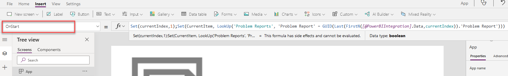

13.   **Insert** タブを選択し、**Media** をクリックして、**Image** を選択します。


14  **Image** の値を次の式に設定します。

```CurrentItem.Photo```

15.  **App** オブジェクトの **...** ボタンをクリックし、**Run OnStart** を選択します。

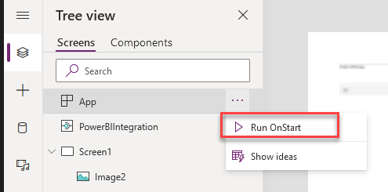

16.   写真が見えるはずです。 写真が表示されない場合は、モデル駆動型アプリに移動し、写真フィールドが空の問題レポートレコードに写真を追加します。


17.  画像の **X** 値を **0** に設定します。
18.  画像の **Y** 値を **0** に設定します。
19.  画像の **Width** 値を以下の式に設定します。

```Parent.Width```

20. 画像の **Height** 値を以下の式に設定します。

```Parent.Height```

21.  画像が画面いっぱいに表示されます。


22.  このページから離れないでください。


#### タスク3：コントロールを追加する

1.  **Insert** タブを選択し、**Label** をクリックします。
2.  追加したラベルを選択し、**Text** の値を次の式に設定します。

```CurrentItem.Title```

3.  ラベルの **Heigh** 値を **60** に設定します。
4.  ラベルの **X** 値を **0** に設定します。
5.  ラベルの **Y** 値を次の式に設定します。

```Parent.Height -Self.Height```

6.  ラベルの **Width** 値を次の式に設定します。

```Parent.Width```

7.  ラベルの **Fill** 値を **RGBA(0, 108, 191, .5)** に設定します。
8.  ラベルの **Color** 値を **RGBA(255, 255, 255, 1)** に設定します。
9.  ラベルの **Align** 値を次の式に設定します。

```Align.Center```

10. これで、ラベルは次の画像のようになります。 タイトルが表示されない場合は、**App** オブジェクトの **...** ボタンをクリックして、**Run OnStart** をもう一度クリックします。


11.  **Insert** タブに移動し、**Icons** をクリックして、**Next** を選択します。
12.  追加したアイコンをダブルクリックして、名前を **Next icon** に変更します。
13.  **Insert** タブに移動し、**Icons** をクリックして、**Back** を選択します。
14.  追加した2番目のアイコンをダブルクリックし、名前を **Back icon** に変更します。
15.  ラベルの右側の上に **Next icon** をドラッグして配置します。
16.  ラベルの左側の上に **Back icon** をドラッグして配置します。
17.  アイコンは下の画像のようになります。


18.  **Next icon** を選択し、**OnSelect** の値を次の式に設定します。

```UpdateContext({CurrentItem: LookUp('Problem Reports', 'Problem Report' = GUID(Last(FirstN([@PowerBIIntegration].Data,currentIndex)).'Problem Report'))});UpdateContext({currentIndex: currentIndex +1})```

19.  **Next icon** の **DisplayMode** 値を次の式に設定します。

```If(currentIndex = CountRows([@PowerBIIntegration].Data), DisplayMode.Disabled, DisplayMode.Edit)```

20.  **Back icon** を選択し、**OnSelect** の値を次の式に設定します。

```UpdateContext({CurrentItem: LookUp('Problem Reports', 'Problem Report' = GUID(Last(FirstN([@PowerBIIntegration].Data,currentIndex)).'Problem Report'))});UpdateContext({currentIndex: currentIndex -1})```

21.   **Back icon** の **DisplayMode** 値を次の式に設定します。

```If(currentIndex > 1, DisplayMode.Edit, DisplayMode.Disabled)```

22.   **Insert** タブに移動し、**Icons** をクリックして、**Check** を選択します。
23.   チェックアイコン **Complete icon** の名前を変更します。
24.   **Complete icon** を画面の右上に移動します。
25.   **Check Icon** のOnSelectを次の式に設定します。 この数式は、行のステータスを完了に更新してから、Power BIを更新します。

```Patch('Problem Reports', CurrentItem, {'Status Reason': 'Status Reason (Problem Reports)'.Completed}); PowerBIIntegration.Refresh()```

26.   **Play** をクリックします。 
27.   次と戻るアイコンをクリックして、画像が変わることを確認します。
28.   プレビューを閉じます。

29.   **File** をクリックします。 
30.   **Save** をクリックします。 
31.   **Cloud** を選択し、**Power BI embed app** を入力します。
32.   **Save** をクリックします。
33.   アプリスタジオのブラウザウィンドウまたはタブを閉じます。
34.   これで、Power BIレポートに戻るはずです。 上部のヘッダーにある **Refresh** をクリックします。
35. **Next** および **Back** アイコンをクリックして、アプリケーションが画像をロードすることを確認します。

    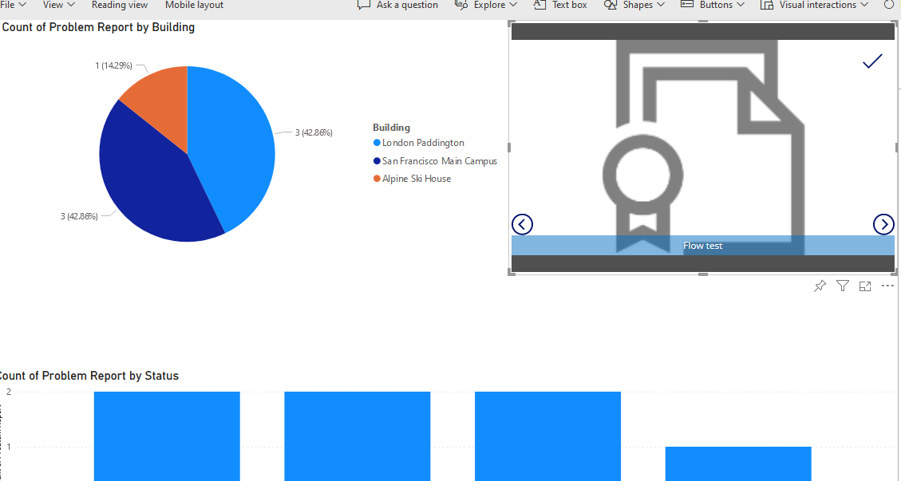

36. 積み上げ縦棒グラフの **Completed** 列を選択し、完了した行数をメモします。
37. **Completed** 以外の積み上げ縦棒グラフの任意の列を選択します。 次のアイコンをクリックすると、次の画像が表示されます。
38. **Complete** アイコンをクリックします。 

    

39. 完了した数が増えるはずです。 完了した数が増えない場合は、更新をクリックして、ビジュアルが更新されるのを待ちます。

    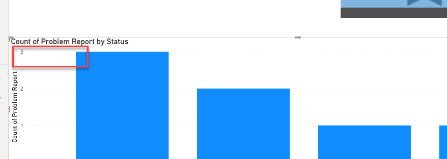

40. **Save**をクリックしてレポートを保存します。


## 課題

* 写真付きの個々のレポートへのドリルダウンを含むダッシュボードとレポート
* 問題のパターンと傾向を報告および分析する
* 目標到達プロセスとしての問題解決ステータスの視覚化

## 補遺

### サンプルデータをインポートする

この演習では、サンプルデータをPower BIサービスにインポートします。 これにより、デスクトップアプリケーションをインストールするために必要なアクセス許可がない場合や、Power BI Desktopを構成してデータに接続する際に問題が発生した場合でも、ラボの演習を完了することができます。 この演習の完了後、**Exercise1** をスキップし、Power BIサービス（[https://app.powerbi.com]（https://app.powerbi.com）を使用して **Exrcise2** でラボを開始できます。）) 

1. [problem-reports-data.pbix](06\Resources\problem-reports-data.pbix) をダウンロードして、コンピューターに保存します。 
2. [Power BI](https://app.powerbi.com/) に移動します。 
3. **311 Workspace** をクリックします。
4. **+New** を展開し、**Upload a file** を選択します。


5. **Local File** を選択します。
6. 以前にダウンロードした **problem-report-data.pbix** ファイルを見つけて選択します。
7. データの読み込みが完了したら、**problem-reports-data** レポートを選択します。
8. **...** をクリックしてから、**Edit** を選択します。


9. これで、このラボの **演習2：Power BIレポートの作成** を開始できます。
