---
lab:
    title: 'Lab 06: Create Power Virtual Agents in Teams'
    module: 'Module 06: AI builder and Power Virtual Agents'
---

> [!NOTE]
> Effective November 2020:
> - Common Data Service has been renamed to Microsoft Dataverse. [Learn more](https://aka.ms/PAuAppBlog)
> - Some terminology in Microsoft Dataverse has been updated. For example, *entity* is now *table* and *field* is now *column*. [Learn more](https://go.microsoft.com/fwlink/?linkid=2147247)
>

# ラボ06：チーム内の仮想エージェントに電力を供給する

## シナリオ

 あなたの組織はE-wasteのリサイクルを試みており、四半期ごとにE-wasteピックアップサービスをスケジュールすることにしました。 施設部門は、OneDrive for businessでExcelファイルを作成し、従業員が自分の名前と、ピックアップしたいアイテムに関する情報をリストに追加できるようにしたいと考えています。
  この演習では、ユーザーから情報を取得してピックアップリストに追加するPower VirtualAgentsボットを作成します。

## 要件

 1. ボットはアイテムに関する情報を取得できる必要があります。
 2. ボットはユーザーに関する情報を取得できる必要があります。
 3. ボットは新しいアイテムをリストに追加できるはずです。

## What you will learn

 1.	TeamsでPower Virtual Agentを作成する方法。
 2. Power Virtual Agentを公開する方法。
 3. Power Virtual Agentsフローテンプレートの使用方法。

## 詳細な手順

### 演習1–PVAボットを作成する

#### タスク1 - ExcelファイルをOneDriveに追加する
このタスクでは、ExcelファイルをOneDrive for businessに追加し、PVAとPowerAutomateを使用してこのファイルに新しい行を追加します。

1. [Microsoft Teams](https://teams.microsoft.com) に移動します 
2. **App launcher** をクリックして、**OneDrive** を選択します。


3. **Upload** をクリックして、**Files** を選択します。

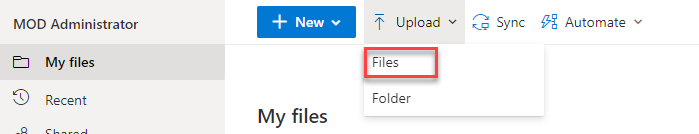

4. ラボリソースフォルダーを参照し、**Recycle.xlsx** ファイルを選択して、開くをクリックします。
5. 追加したファイルをクリックして開きます。


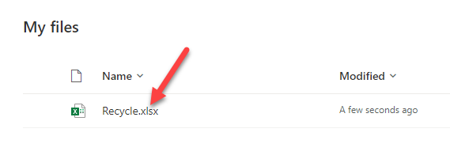

6. ヘッダーだけが必要です。 ファイルとOneDriveブラウザのタブを閉じます。

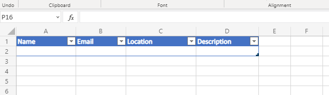


#### タスク2 - PVAをインストールする

このタスクでは、PVAをインストールします。

1. [Microsoft Teams](https://teams.microsoft.com) に移動します。
2. **...More added apps** をクリックし、**power virtual** を検索して、**Power Virtual Agents** を選択します。

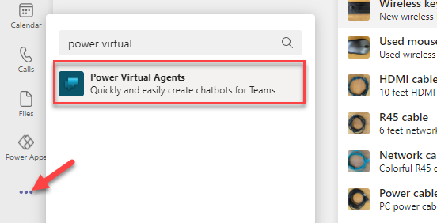

3. **Add** をクリックします。
4. **Power Virtual Agents** を右クリックし、**Pin** を選択します。 （**Power Virtual Agents** メニューが左側のメニューに表示されない場合は、**...More added aaps** をもう一度クリックして、最近のものから固定します。）

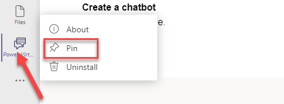

5. このページから離れないでください。

#### タスク3 - ボットを作成する

このタスクでは、ボットを作成します。

1. **Power Virtual Agents** を選択し、**Start now** をクリックします。

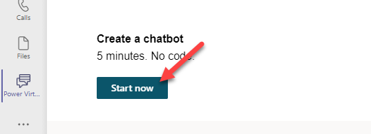

2. 作成した **Green** チームを選択し、**Continue** をクリックします。
3. 名前に **Green Bot** と入力し、**Create** をクリックします。
4. ボットが作成されるのを待ちます。
5. **Explore bot** をクリックします。
6. 左下のテキストボックスに **Hello** と入力し、**Send** をクリックします。 テキストボックスが表示されない場合は、左下にある **Test your bot** ボタンをクリックしてください。
7. ボットはデフォルトの挨拶で応答する必要があります。 この挨拶は次のタスクで編集します。


8. 左下にあるボットアイコンをクリックすると、ボットを表示/非表示にできます。 これにより、オーサリングキャンバスにより多くのスペースが与えられます。

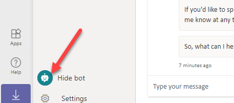

9. このページから離れないでください。


#### タスク4 - あいさつを編集する
このタスクでは、デフォルトのグリーティングを編集します。

1. **Topics** を選択し、クリックして **Greeting** トピックを開きます。

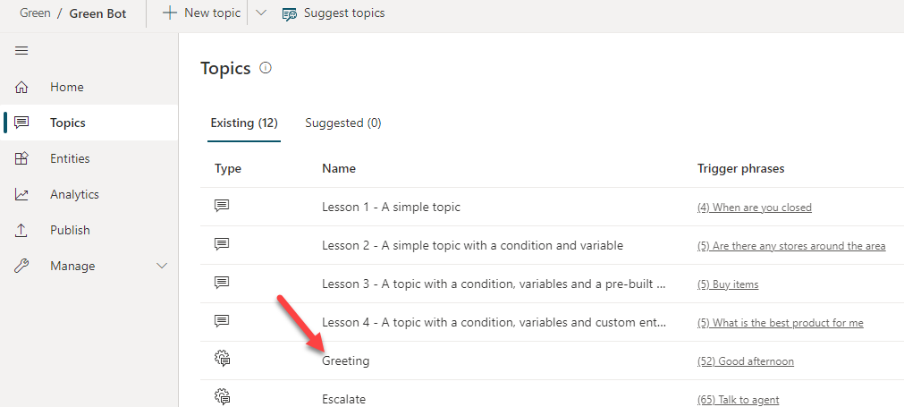

2. このトピックのトリガーフレーズを見てください。
3. **Go to authoring canvas** ボタンをクリックします。

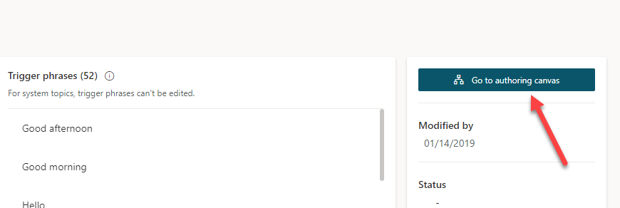

4. 最初の **Message** に移動し、メッセージを以下のテキストに置き換えます。

```Hi! I'm a virtual agent. I can help you recycle e-waste by posting items to the Upcycle application or add them to the quarterly e-waste pickup list.```

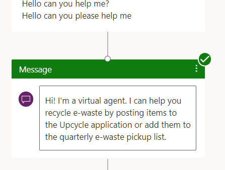

5. **Save** をクリックします。
6. **Test your bot** をクリックしてボットを表示します。
7. **Hey** と入力し、**Send** をクリックします。
8. これで、ボットは更新されたメッセージを使用するはずです。

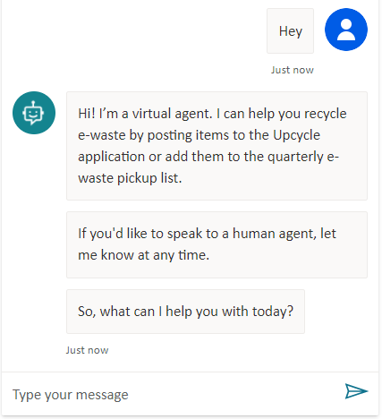

9. Hide the bot.
10. このページから離れないでください。

#### タスク5 - トピックを作成する
このタスクでは、ボットが問い合わせに応答できるように、ボットの新しいトピックを作成します。

1. **Topics** を選択し、**+ New topic** をクリックします。

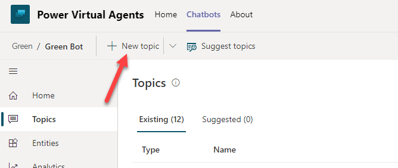

2. 名前に **Recycle Reuse Reduce** と入力します。
3. トリガーフレーズに **Recycle** を入力し、**Add** をクリックします。

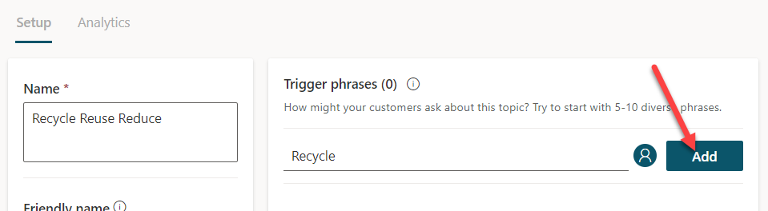

4. 別のトリガーフレーズとして **E-waste** と入力し、**Add** をクリックします。
5. 別のトリガーフレーズとして **Green** と入力し、**Add** をクリックします。
6. 別のトリガーフレーズとして **Add me** と入力し、**Add** をクリックします。
7. 別のトリガーフレーズとして **Upcycle** と入力し、**Add** をクリックします。
8. 別のトリガーフレーズとして **Reuse** と入力し、**Add** をクリックします。
9. 別のトリガーフレーズとして **Reduce** と入力し、**Add** をクリックします。
10. 別のトリガーフレーズとして **Recycle list** と入力し、**Add** をクリックします。
11. これで、少なくとも8つのトリガーフレーズが必要になります。 **Save topic** をクリックします。

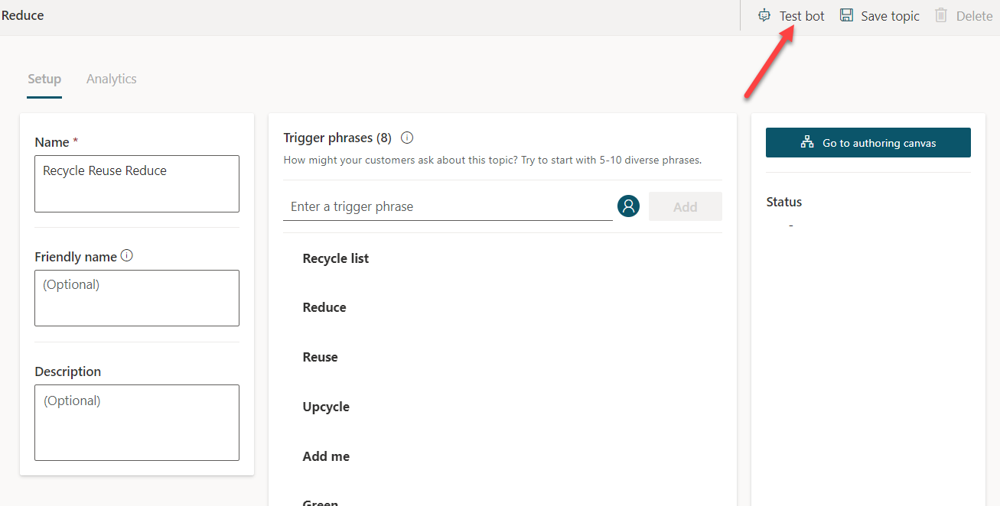

9. **Go to authoring canvas button** をクリックします。
10. メッセージに **I can help you that* と入力し、**+ Add node** ボタンをクリックします。

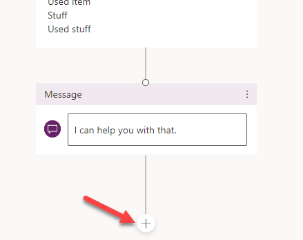

11. **Ask a question** を選択します。

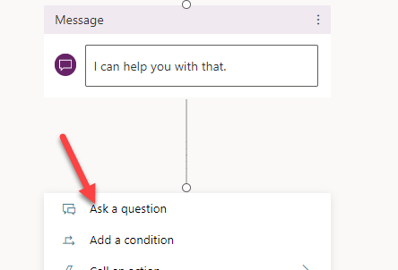

12. 質問するテキストボックスに以下のテキストを入力します。

```I can add your item to the Upcycle application or to the e-waste pick-up list. What would you like me to do?```

13.  IDに **Multiple choice options** が選択されていることを確認し、最初のオプションとして**Add to the Upcycle app** と入力し、**+ New option** をクリックします。

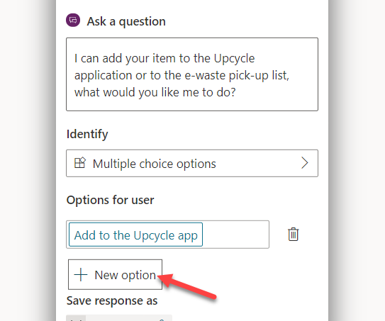

14. 別のオプションとして **Add to the pick-up list** と入力します。
15. これで、2つの条件があります。 いずれかの条件の **...** オプションボタンをクリックし、**Delete** をクリックします。

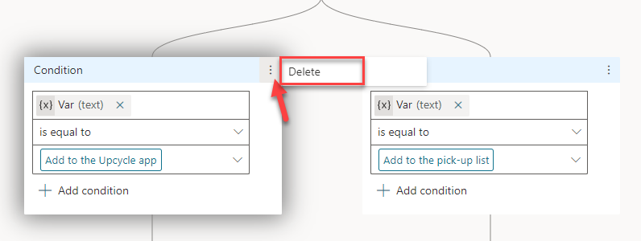

16. 他の条件を削除します。 ピックアップリストへのアイテムの追加とUpcycleアプリケーションへのアイテムの追加には同様の情報が必要だったため、条件を削除します。

17. 条件メニューの2番目の入力値を **has value** に変更します。

    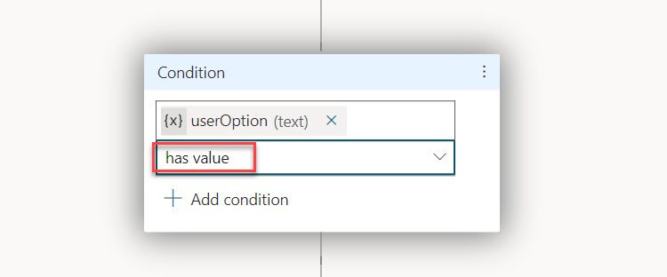

18. 変数の編集アイコンをクリックします。

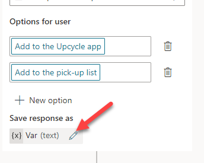

18. 変数名を **UserOption** に変更し、変数のプロパティペインを閉じます。

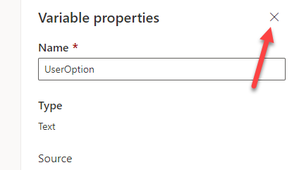

19. **+ Add node** をクリックし、**Ask a question** を選択します。
20. 質問するテキストボックスに以下のテキストを入力します。

```What is the name of the item?```

21.   **Identify** ドロップダウンをクリックして、**User's entire response** を選択します。

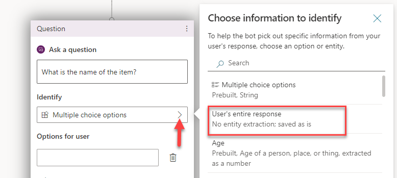

22.  **Edit variable** アイコンをクリックします。

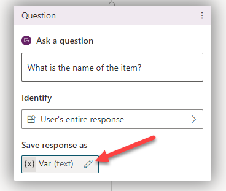

23. 変数名を **ItemName** に変更し、変数のプロパティペインを閉じます。
24. 質問の後に **+ Add node** をクリックします。
25. もう一度 **Ask a question** を選択します。
26. 質問するテキストボックスに以下のテキストを入力します。

```What is the description of this item?```

27. **Identify** ドロップダウンをクリックして、**User's entire response** をもう一度選択します。
28. **Edit variable** アイコンをもう一度クリックします。
29. 変数名を **Description** に変更し、変数のプロパティペインを閉じます。
30. 質問の後に **+ Add node** をクリックします。
31. もう一度 **Ask a question** を選択します。
32. 質問するテキストボックスに以下のテキストを入力します。

```What is the location of this item?```

33. **Identify** ドロップダウンをクリックして、 **User's entire response** をもう一度選択します。
34. **Edit variable** アイコンをもう一度クリックします。
35. 変数の名前を **Location** に変更し、変数のプロパティペインを閉じます。
36. 3つの質問は次の画像のようになります。 **Save** をクリックします。

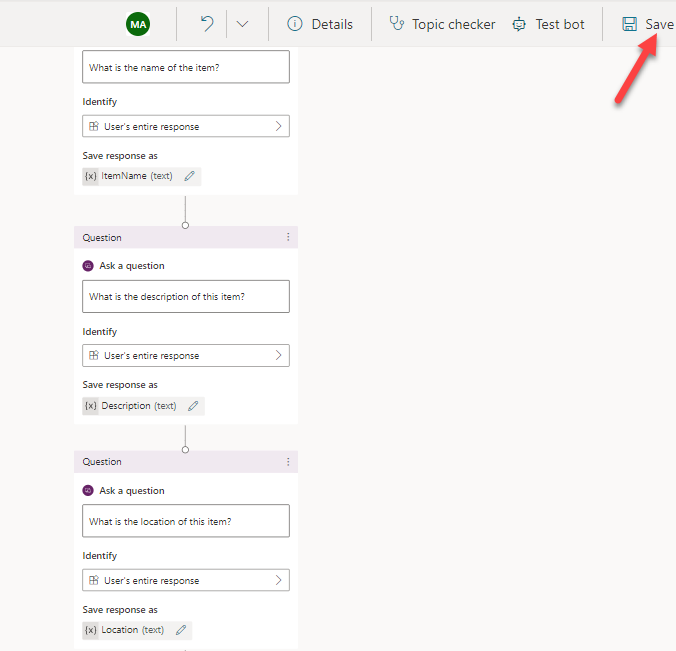

37. このページから離れないでください。


#### タスク6 - フローを作成する

このタスクでは、ユーザーオプションに応じて、アイテムをリサイクルリストまたはアップサイクルアプリケーションに追加するフローを作成します。

1.  最後の質問に移動し、**+ Add node** をクリックして、**Call an action** を選択します。


2.  **Create a flow** をクリックします。
3.  **Power Virtual Agents Flow Template** を選択します。

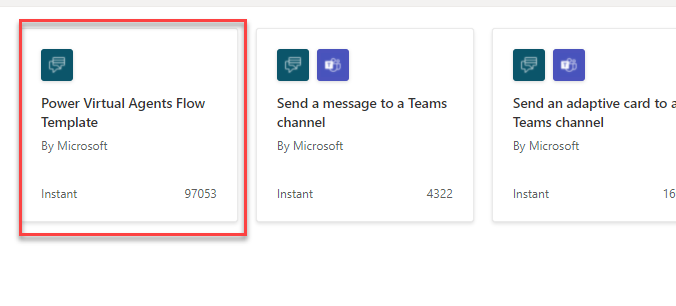

4.  フローの名前を　**Add item to app or list** し、**+ Add an input** をクリックします。

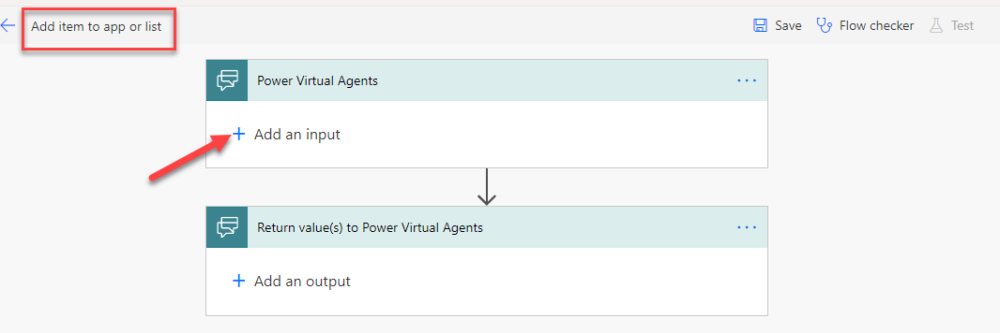

5.  **Text** を選択します。
6.  **User ID**　を入力し、**+　Add an input** をもう一度クリックします。

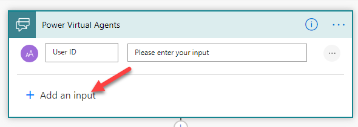

7.  **Text** を選択します。
8.  **UserOption** と入力し、**+ Add an input** をもう一度クリックします。
9.  **Text** を選択します。
10. **ItemName** と入力し、**+ Add an input** をもう一度クリックします。
11. **Text** を選択します。
12. **Description** と入力し、**+ Add an input** をもう一度クリックします。
13. **Text** を選択します。
14. **Location** を入力します。
15. これで、5つの入力があります。
16. **+ Insert a new step** をクリックし、**Add an action** を選択します。

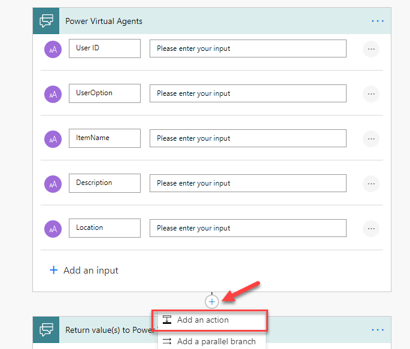

17.  Initialize を検索し、**Initialize variable** を選択します。

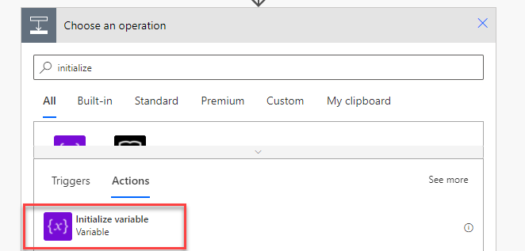

18.  名前に **Response to bot** と入力し、Typeに **String** を選択します。
19.  新しいステップを挿入をクリックして、**Add an action** を選択します。

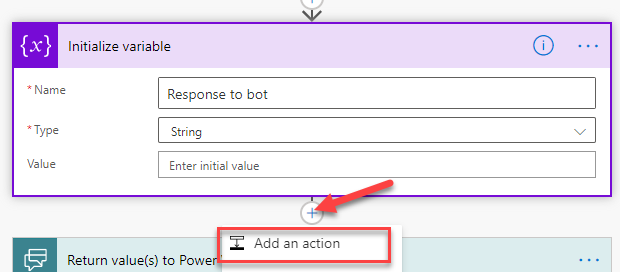

20.  **+ Insert a new step** をもう一度クリックし、**Add an action** を選択します。
21.  get user profile andを検索し、**Get user profile (V2)** を選択します。

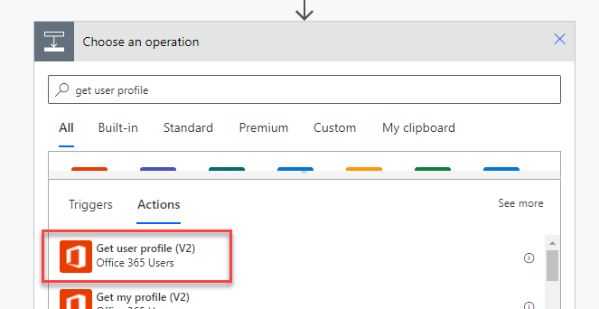

22.  **User (UPN)** フィールドをクリックし、動的コンテンツペインから **User ID** を選択します。

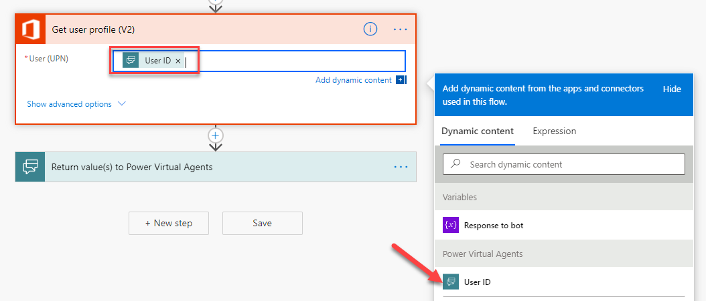

23.  **+ Insert a new step** をクリックし、再度、 **Add an action** を選択します。
24.  条件を検索し、**Condition** を選択します。
25.  最初の **Choose a value** フィールドをクリックし、動的コンテンツペインから **UserOption** を選択します。

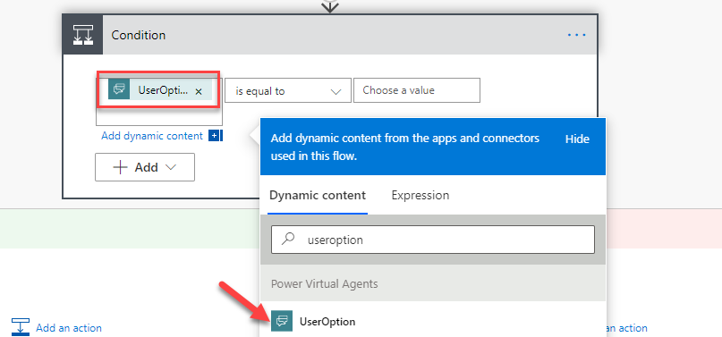

26.  **is equal to** を選択し、**Add to the Upcycle app** と入力します。
27.  ** f no** ブランチに移動し、**Add an action** をクリックします。

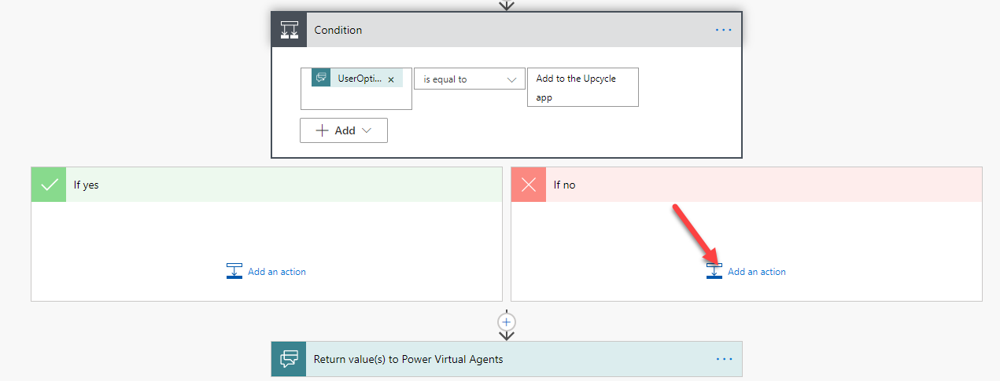

28.  行の追加を検索し、Excel Online（ビジネス）から **Add a row into a table** を選択します。

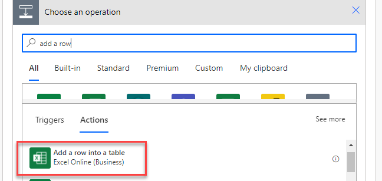

29.  場所には **OneDrive for Business**、ドキュメントライブラリには **OneDrive**、ファイルには **Recycle.xlsx**、テーブルには **PickupTable** を選択します。
30.  **Name** フィールドをクリックし、動的コンテンツペインから **Display Name** を選択します。

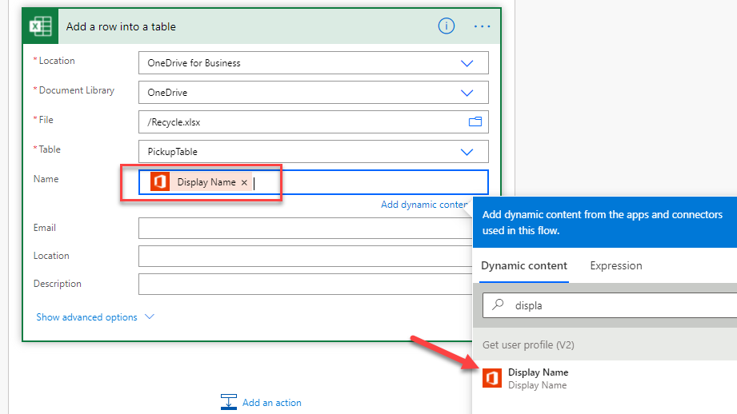

31.  **Emal** フィールドをクリックし、動的コンテンツペインから **Mail** を選択します。
32.  **Location** フィールドをクリックし、動的コンテンツペインの Power VirtualAgents ステップから **Location** 動的コンテンツを選択します。

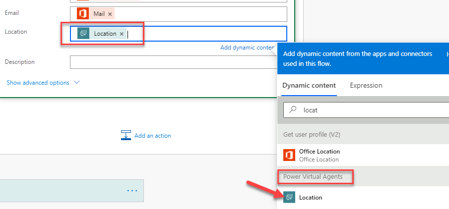

33.  **Description** フィールドをクリックし、動的コンテンツペインから **Description** を選択します。
34.  フローステップは次の画像のようになります。 **Add an action** をクリックします。

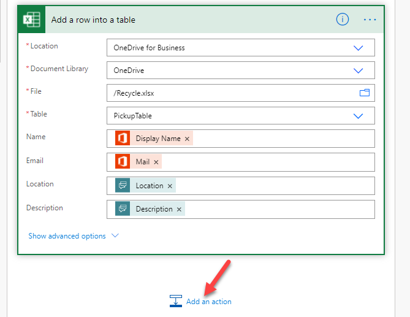

35.  set variableを検索し、**Set variable** を選択します。
36.  名前として **Response to bot** を選択し、値フィールドをクリックして、動的コンテンツペインから **ItemName** を選択します。

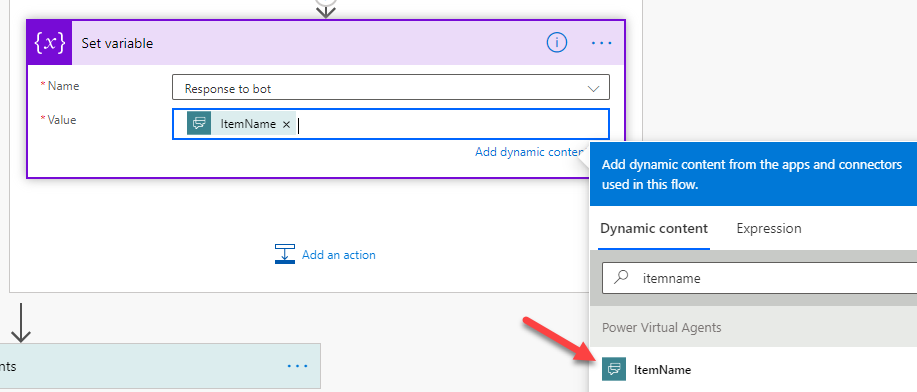

37. ItemNameの後に以下のテキストを追加します。

``` was added to the e-waste pick-up list.```

38. **If yes** ブランチに移動し、**Add an action** をクリックします。

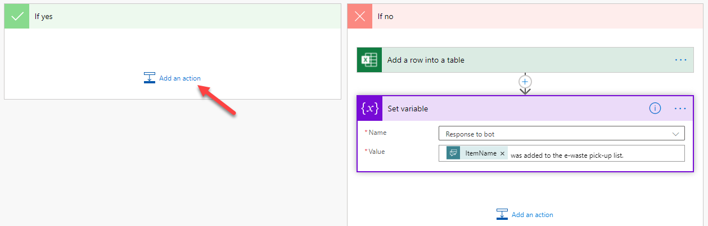

39. Add new row を検索し、Microsoft Dataverse から**Add a new row** を選択します。

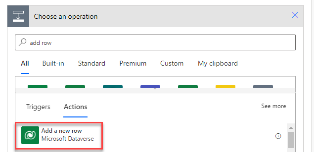

40. テーブル名として **Gadgets** を選択します。
41. Location フィールドをクリックし、動的コンテンツペインから **Location** を選択します。
42. Name フィールドをクリックし、動的コンテンツペインから **ItemName** を選択します。
43. **Show advanced options** をクリックします。


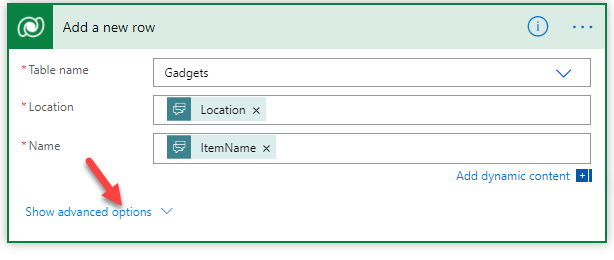

44. 可用性で **Available** を選択し、Description フィールドをクリックして、動的コンテンツペインから **Description** を選択します。
45. 新しい行の追加ステップの後で、**Add an action** をクリックします。
46. set variableを検索し、**Set variable** を選択します。
47. 名前で **Response to bot** を選択し、値フィールドをクリックして、動的コンテンツペインから **ItemName** を選択します。
48. ItemNameの後に以下のテキストを追加します。

``` was added to the Upcycle application.```

48. 条件の2つのブランチは、次の画像のようになります。 クリックして、**Return value(s) to Power Virtual Agents** ステップを展開します。

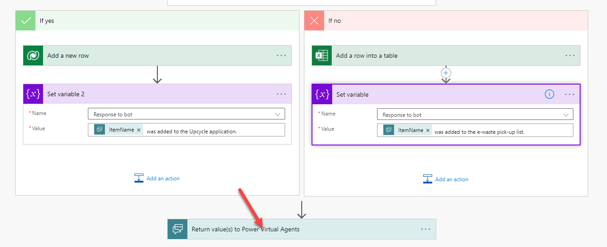

49. **+ Add an output** をクリックします。
50. **Text** を選択します。
51. **Response** と入力し、値フィールドをクリックして、動的コンテンツペインから **Response to bot** を選択します。

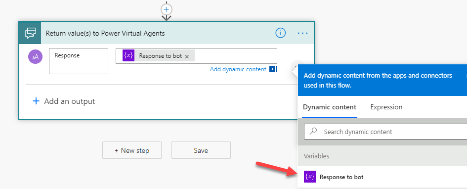

52. **Save** をクリックしてフローを保存します。 
53. フロー名の横にある **<-** 戻るボタンをクリックします。

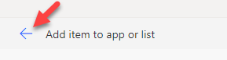

54. これで、ボットオーサリングキャンバスに戻るはずです。
55. このページから離れないでください。

#### タスク7 - コールフロー
このタスクでは、Power VirtualAgentsボットからのアクションとしてフローを呼び出します。

1.  最後の質問に移動し、**+ Add node** をクリックして、**Call an action** を選択します。
3.  作成した **Add item to app or list** フローを選択します。

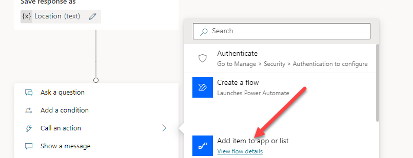

4.  **User ID** をクリックし、**bot.UserId** を選択します。

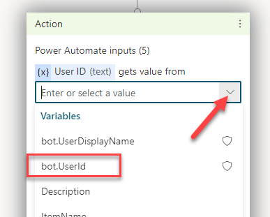

5.  **UserOption** をクリックし、**UserOption** を選択します。
6.  **ItemName** をクリックし、**ItemName** を選択します。
7.  **Description** をクリックし、**Description** を選択します。
8.  **Location** をクリックし、**Location** を選択します。
9.  **+ Add node** をクリックし、**Show a message** を選択します。


8.  **Insert variable** アイコンをクリックして、**Response** を選択します。

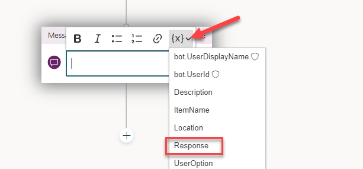

9.  **+ Add node** をクリックし、**End with survey** を選択します。
10.  ボットの会話の終わりは、次の画像のようになります。


11.  **Save** をクリックして変更を保存し、ボットが保存されるのを待ちます。
12.  このページから離れないでください。

### 演習2 – ボットをテストして公開する

#### タスク1 - ボットのテスト
このタスクでは、ボットをテストします。

1.  画面の左下にあるボットの表示オプションを選択して、ボットが非表示になっている場合は **Show** します。
2.  **Recycle** と入力し、**Send** をクリックします。
3.  ボットは、アイテムを電子廃棄物リストに追加するか、アップサイクルアプリケーションに追加するかを尋ねる必要があります。 **Add to the Upcycle app** を選択します。

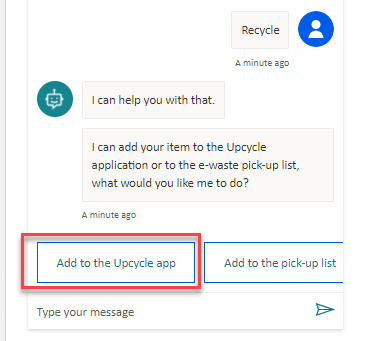

4.  ボットは名前を入力するように要求する必要があります。 **Bot charger** と入力し、**Send** をクリックします。
5.  ボットはアイテムの説明を尋ねるはずです。 **Universal bot charger** と入力し、**Send** をクリックします。
6.  ボットはアイテムの場所を尋ねる必要があります。 **Building 4 Room A-754** と入力し、**Send** をクリックします。
7.  ボットは、アイテムがUpcycleアプリケーションに追加されたことを通知し、質問に回答したかどうかを尋ねる必要があります。 **Yes** をクリックします。

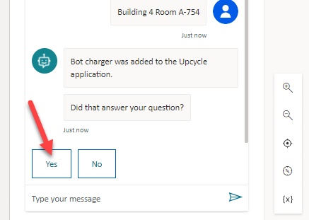

7.  ボットはあなたにあなたの経験を評価するように頼むべきです。 それに評価を与えます。
8.  ボットはあなたに感謝し、それが他の何かであなたを助けることができるかどうかあなたに尋ねるべきです。 **Yes**をクリックします。
9.  **Reuse** と入力し、**Send** をクリックします。
10. 今回は**Add to the pick-up list** を選択します。
11. ボットは名前を入力するように要求する必要があります。 **Bad bot Charger** と入力し、**Send** をクリックします。
12. ボットはアイテムの説明を尋ねるはずです。 **Bad Universal bot Charger**と入力し、**Send** をクリックします。
13. ボットはアイテムの場所を尋ねる必要があります。 **Building 4 Room A-754** と入力し、**Send**をクリックします。
14. ボットは、アイテムが電子廃棄物ピックアップリストに追加されたことを通知し、質問に回答したかどうかを尋ねる必要があります。 **Yes** をクリックします。

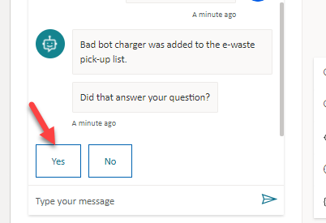

15. ボットを評価します。
16. **No, thanks** を選択します。
17. ボットは会話を終了する必要があります。
18. **Teams** を選択します。

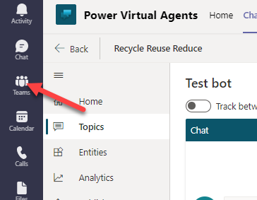

19. **Green** チームチャットを選択します。 **Upcycle** タブを選択します。
20. ボットを検索します。 ボットがアプリケーションに追加された **Bot changer** が表示されます。

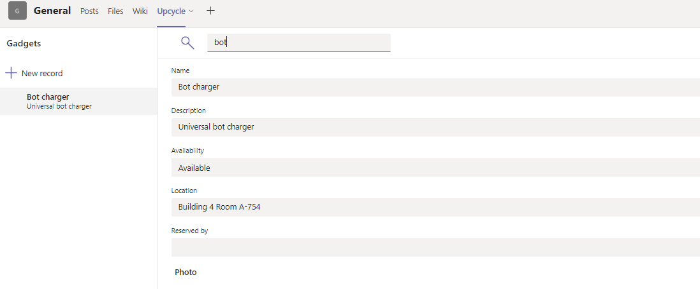

20. アプリランチャーをクリックして、**OneDrive** を選択します。

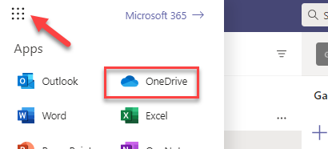

21.  クリックして**Recycle.xlsx** ファイルを開きます。
22.  ボットによって追加された **Bad universal bot charger** が表示されます。

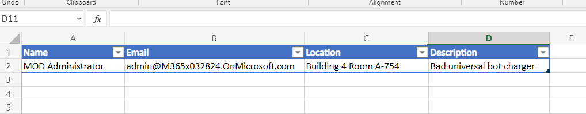

23. **Excel file** を閉じます。 
24. **OneDrive** を閉じます。 
25. これで、Upcycleアプリケーションに戻るはずです。
26. このページから離れないでください。

#### タスク2 - ボットを公開して追加する
このタスクでは、作成したボットを公開します。

1.  **Power Virtual Agents** を選択します。

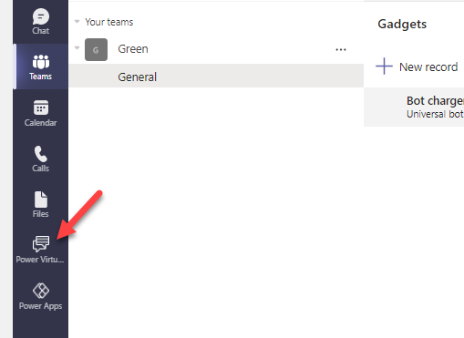

2.  **Chatbots** タブを選択し、クリックして **Green Bot** を開きます。

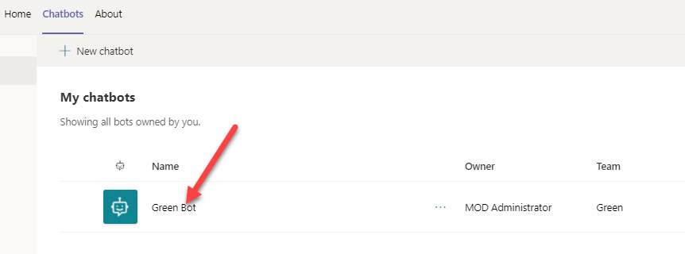

3.  **Publish** をクリックします。

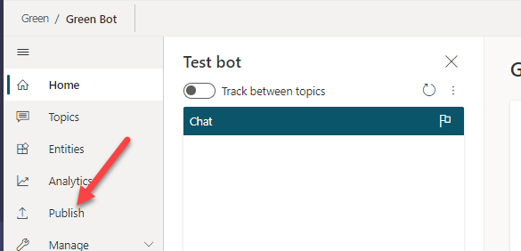

4. もう一度 **Publish** をクリックします。
5. 最新のコンテンツを公開ポップアップで **Publish** をクリックし、公開が完了するのを待ちます。
6. クリックして **Manage** を展開し、**Channels** を選択します。

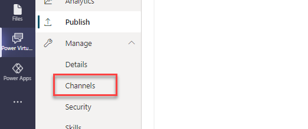

7. **Microsoft Teams** を選択します。
8. **Add to Teams** をクリックします。

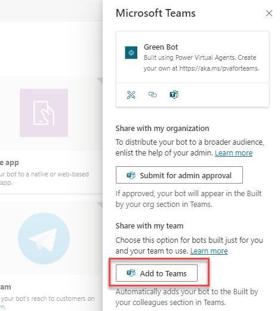

9. **Apps** を選択します。

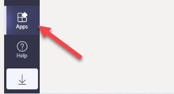

10. **Built for your org** を選択し、作成した **Green Bot** をクリックします。

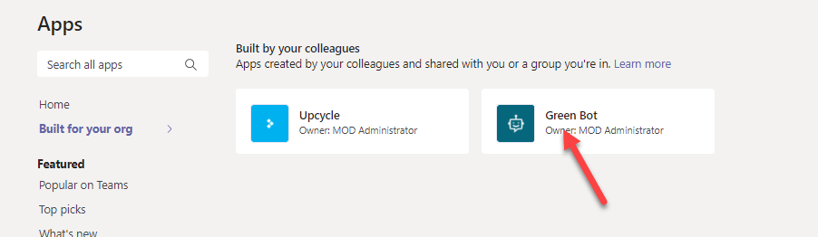

11. **Add** をクリックします。
12. ボットがあなたに挨拶するはずです。 ボットを再度テストできます。
